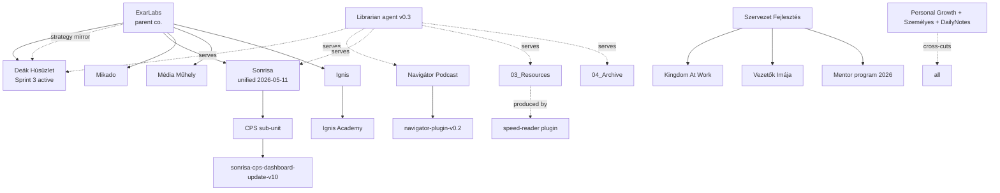

# Knowledge Map — domain landscape (tier-1)

> Bird's-eye view of the standalone domains in the vault and their relationships.
> Per-unit detail lives in **tier-2 KNOWLEDGE_MAPs** (drill-down links below each row).

## Domains

### A. Business / Product

| Domain | Where | Status signal | Drill-down (tier-2) |
|---|---|---|---|
| **Deák Húsüzlet (DH)** | `02_Areas/Deák Húsüzlet/` | Sprint 3 ACTIVE (PROJECT_STATE v1.6, 2026-04-17). Beta launch ~2026-05-15. | `02_Areas/Deák Húsüzlet/00_KNOWLEDGE_MAP.md` |
| **Sonrisa** | `02_Areas/Sonrisa/` | **Unified 2026-05-11** — previous `01_Projects/Sonrisa/` removed. CPS sub-unit has its own PROJECT_STATE. | `02_Areas/Sonrisa/00_KNOWLEDGE_MAP.md` |
| **ExarLabs** | `02_Areas/ExarLabs/` | Active work memory; parent of DH. | — (no tier-2 yet) |
| **Mikado** | `02_Areas/Mikado/` | Active (small, "Tavaszi otthon"). | — |
| **Média Műhely** | `02_Areas/Média Műhely/` | Active. Studio. | — |
| **Ignis** | `02_Areas/Ignis/` | Active (AI Kurzus, IgnisXY, HBC). | — |
| **Ignis Academy** | `02_Areas/Ignis Academy/` | Startup Learning / research phase. | — |
| **Pályázat** | `02_Areas/Pályázat/` (+ DH, ExarLabs sub-folders) | Sparse. | — |

### B. Content / Media

| Domain | Where | Status signal | Drill-down (tier-2) |
|---|---|---|---|
| **Navigátor Podcast** | `02_Areas/Navigátor Podcast/` | Active. Fázis 4a channel audit in flight, ~5,780 subs, ~354K views. | `02_Areas/Navigátor Podcast/00_KNOWLEDGE_MAP.md` |

### C. Organization / Leadership

| Domain | Where | Status signal | Drill-down |
|---|---|---|---|
| **Szervezet Fejlesztés** | `02_Areas/Szervezet Fejlesztés/` | Active. Sub-units: `Kingdom At Work/`, `Vezetők Imája/`, `Mentor program 2026/`. KAW has full Vezetői Kézikönyv. | — |
| **Szervezet fejlesztés (Projects)** | `01_Projects/Szervezet fejlesztés/` | Stub. Only `Veszprém - Kecskemét körút/` (2 files). Consolidation candidate. | — |

### D. Personal

| Domain | Where | Note |
|---|---|---|
| **Personal Growth** *(sic)* | `02_Areas/Personal Growth/` | Habits, PKM, Movies, Ideas, Spiritual. Folder-name typo. |
| **Személyes** | `02_Areas/Személyes/` | Family-oriented; tiny (5 files). |
| **Daily Notes** | `05_DailyNotes/` | 2025 + 2026 daily journal entries (219 files). |

### E. Reference / Resources

| Domain | Where | Drill-down (tier-2) |
|---|---|---|
| **03_Resources** | `03_Resources/` | `03_Resources/00_KNOWLEDGE_MAP.md` |
| **04_Archive** | `04_Archive/` | `04_Archive/00_KNOWLEDGE_MAP.md` |

### F. Tooling / Meta (BDOS)

| Domain | Where | Note |
|---|---|---|
| **BDOS / Agent prompts** | `00_Prompts/` | Plugin + agent + skill definitions. Agents: `librarian` (v0.3). Plugins: `navigator-plugin-v0.2`, `speed-reader-plugin`, `general-utils.plugin`, `Personal Utils Plugin`, `VibeCoding`, `Utils`, `Claude/Plugins`, `Claude/Skills`. Agent meta-index: `00_Prompts/BDOS/00_AGENTS_INDEX.md`. |
| **Templates** | `Templates/` | Note templates. Several `.bak` files (cleanup candidate). |

## Cross-domain relationships

- **DH ←→ ExarLabs:** DH is operated under ExarLabs. ExarLabs maintains a parallel strategy folder `02_Areas/ExarLabs/resources/Deák Platform/` (24-month roadmap, pilot-concept). Possible duplication with DH's own `Business Development/strategy/24-month-roadmap.md` — flagged in `00_GAPS.md`.
- **Navigátor Podcast ←→ Tooling:** podcast is the heaviest consumer of the BDOS plugin layer (`navigator-plugin-v0.2`, episode-synthesis-v0.3, episode-prep-v0.3, navigator-context-v0.3 skills).
- **Sonrisa ←→ Tooling:** CPS has a dedicated skill `sonrisa-cps-dashboard-update-v10` for monthly Excel updates.
- **Speed reader → 03_Resources:** book/article notes are produced via the `speed-reader` plugin into PARA folders under `03_Resources/`.
- **Szervezet Fejlesztés ←→ KAW (Kingdom At Work):** KAW lives inside Szervezet Fejlesztés; cross-references with `Vezetők Imája/` (related but separate program).
- **Vault-wide ←→ BDOS:** Librarian (this agent) serves all units via the two-tier retrieval layer.

## Mermaid sketch



## Heat map — by file count (post-BIN exclusion)

```
Deák Húsüzlet ████████████████████████████████ 1170 (incl. sub-units)
05_DailyNotes ██████████ 219
Navigator     ██████████ 214
Sonrisa       █████████  ~167
Resources     ████       78
Prompts       ███        66
Szervezet F.  ███        62
Ignis         ██         58
ExarLabs      ██         48
04_Archive    █          37
Personal Gr.  █          31
Ignis Acad.   █          22
Média Műhely  █          21
copilot prom. ▌          13
Mikado        ▌          11
Templates     ▌          10
Személyes     ▎           5
01_Projects   ▏           2
```

Note: `02_Areas/` total in 00_INDEX (1170) is the **global** count for the folder including units with their own tier-2 indexes. Tier-2 file counts (e.g. DH 174) are the curated substansive set the unit librarian indexed; deltas are BIN, scratch, and ignored content.
