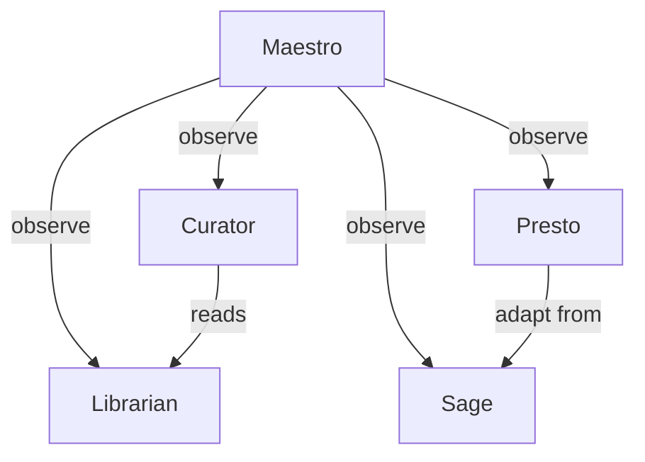

# BDOS Metadata Indexing Architecture — Research

> How does a markdown-native cognitive vault evolve into a high-speed, metadata-aware, queryable operating system — without sacrificing human readability?

This document is the result of a deep architecture investigation commissioned for Librarian v0.7+ planning. It covers six dimensions: Python library landscape, query architecture patterns, token optimization, Librarian-specific applications, visualization possibilities, and architectural recommendations including anti-patterns.

---

## 1. Python Libraries — Comparison

### Markdown Parsing

**`python-frontmatter`**
- Purpose: Reads and writes YAML frontmatter from `.md` files cleanly.
- Speed: Very fast for frontmatter-only extraction (microseconds per file for reads, no body parsing needed).
- Memory: Minimal — loads only frontmatter dict by default.
- BDOS fit: **Primary recommendation for frontmatter extraction.** The `load()` function returns both metadata dict and body string separately, allowing frontmatter-only operations without parsing the full document. Critical for index building.
- Install: `pip install python-frontmatter` — zero heavy dependencies.

```python
import frontmatter

post = frontmatter.load("path/to/note.md")
meta = post.metadata  # {'status': 'active', 'date': ..., 'tags': [...]}
# body is post.content — only parse when needed
```

**`PyYAML` / `ruamel.yaml`**
- `PyYAML`: Fast, well-tested, standard. Round-trips YAML without preserving comments/formatting.
- `ruamel.yaml`: Preserves formatting and comments on write. Slower than PyYAML (~2-3x overhead), but critical if you write back to frontmatter without destroying human formatting.
- BDOS fit: Use `ruamel.yaml` only for write-back operations (frontmatter normalization in future tidy sub-mode). For read-only extraction, `python-frontmatter` wraps PyYAML cleanly enough.

**`markdown-it-py`**
- Full CommonMark parser. Returns an AST you can walk.
- Speed: ~500-2000 files/second for short notes, slower on long files.
- BDOS fit: Overkill for most Librarian operations. Useful only if you need structured body parsing (e.g., extracting headings as section map, counting H2s). Not needed for frontmatter-only workflows.

**`mistune`**
- Faster than `markdown-it-py` (roughly 2-3x), less spec-compliant.
- BDOS fit: Same as above — only relevant for body-level structural extraction. Not a priority for v0.7.

**`marko`**
- Spec-compliant, moderate speed, extensible.
- BDOS fit: Low priority, same category as mistune/markdown-it-py.

### Indexing Backends

**`sqlite3` (stdlib)**
- Built-in, zero install, reliable, battle-tested.
- Speed: Metadata queries on 10,000-row tables complete in <5ms. Full-text search with FTS5 extension is fast (~50ms for vault-scale).
- Memory: Near-zero overhead (file-backed).
- BDOS fit: **Primary recommendation for metadata index.** A single `vault_index.db` file is fully human-inspectable (via DB Browser, Datasette, or `sqlite3` CLI), portable, and Git-friendly if you `.gitignore` it (regenerable). Schema can map directly to frontmatter fields.
- FTS5 extension: Built into Python's sqlite3 on macOS — enables full-text search on extracted body text or frontmatter string values.

```python
import sqlite3

conn = sqlite3.connect(".vault_cache/index.db")
# Schema example:
conn.execute("""
CREATE TABLE IF NOT EXISTS notes (
    path TEXT PRIMARY KEY,
    title TEXT,
    status TEXT,
    date TEXT,
    tags TEXT,       -- JSON array stored as string
    area TEXT,       -- derived from path
    mtime REAL,      -- os.path.getmtime
    word_count INTEGER,
    description TEXT
)
""")
# Query example — Librarian retrieve:
results = conn.execute("""
    SELECT path, title, description, status
    FROM notes
    WHERE status IN ('active', 'draft')
      AND area = 'Deák Húsüzlet'
      AND date > '2026-01-01'
    ORDER BY date DESC
    LIMIT 10
""").fetchall()
```

**`SQLAlchemy`**
- Full ORM layer over SQLite (or Postgres/MySQL).
- BDOS fit: Overkill for a vault index. Adds 200KB+ import overhead, complex setup. Use raw `sqlite3` unless the vault scales beyond 50,000 files (unlikely).

### Filesystem Watching

**`watchdog`**
- Cross-platform filesystem event watcher. Detects `FileModified`, `FileCreated`, `FileDeleted`, `FileRenamed`.
- Speed: Near-zero latency (OS-native events on macOS via FSEvents, Linux via inotify).
- BDOS fit: **Recommended for incremental index refresh** (Librarian v0.8 backlog item). A watchdog daemon listening on the vault root can trigger partial re-index on file change — eliminating full scans. One event = one frontmatter re-read + one DB row update.
- Install: `pip install watchdog` — lightweight.

**`pyinotify`**
- Linux-only. Not relevant for macOS-primary vault.

### Search

**`ripgrepy` (subprocess wrapper around `rg`)**
- `rg` (ripgrep) is already available on the system via Homebrew. Speed: 10-100x faster than Python `grep` for pattern matching across vault.
- BDOS fit: Already used implicitly via `Bash` tool in Librarian. Formalizing as a Python subprocess call (`subprocess.run(["rg", "--json", pattern, vault_path])`) gives structured JSON output with file path, line number, and match text — ideal for body-level search after metadata pre-filter.

**`whoosh`**
- Pure-Python full-text search index. No external dependencies.
- Speed: Decent for <10,000 documents (~100ms queries), degrades on larger corpora.
- BDOS fit: Acceptable for BDOS vault size now, but maintenance overhead (index files, schema migration) exceeds benefit when SQLite FTS5 covers the same use case. **Not recommended** — SQLite FTS5 is simpler.

**`tantivy-py` (Tantivy via Python bindings)**
- Rust-backed search engine (like Elasticsearch but tiny). Extremely fast — sub-millisecond queries.
- BDOS fit: Impressive speed, but: requires Rust toolchain to install, binary dependency, overkill for <5,000 file vault. Consider only if vault grows to 50,000+ files or if semantic search becomes primary workflow. Flag for v0.9+ evaluation.

**`Meilisearch` (via SDK)**
- External search server (runs as separate process). REST API.
- BDOS fit: Not appropriate — BDOS is file-local, not service-oriented. Adds operational complexity (daemon management, port conflicts) for no benefit over SQLite FTS5 at vault scale.

### Vector / Semantic Indexing

**`chromadb`**
- Embedded vector database, pure Python, SQLite-backed under the hood.
- BDOS fit: The most vault-compatible vector store. Allows semantic search ("find notes similar to this concept") without external services. Relevant for Librarian's backlog item "Semantic retrieve." Stores embeddings alongside metadata — can be queried with metadata filters (e.g., `where={"status": "active"}`).
- Install: `pip install chromadb` — moderate install size (~50MB with dependencies).

**`faiss`**
- Facebook's vector similarity library. Very fast for pure ANN (approximate nearest neighbor) search.
- BDOS fit: Lower-level than chromadb — no built-in metadata filtering, no persistence format. Would require significant wrapper code. Not recommended over chromadb for BDOS purposes.

**`lancedb`**
- Newer embedded vector DB, columnar storage (Arrow-based), fast, supports hybrid search (vector + metadata filter).
- BDOS fit: Interesting v0.9+ candidate. More modern than chromadb but less mature ecosystem. Worth monitoring.

**`qdrant-client`** (Qdrant client)
- Client for Qdrant server — requires running a separate service.
- BDOS fit: Same issue as Meilisearch — service dependency. Not appropriate for local vault.

### Graph Libraries

**`networkx`**
- Pure Python, rich graph algorithms, easy to use.
- Speed: Fine for graphs up to ~100,000 nodes. BDOS vault graph (files as nodes, wikilinks as edges) would have <10,000 nodes — trivially fast.
- BDOS fit: **Recommended for cross-reference and orphan detection** (tidy mode). Build from wikilink extraction. Algorithms relevant to BDOS: `nx.isolates()` (orphan detection), `nx.weakly_connected_components()` (isolated clusters), `nx.pagerank()` (importance scoring for retrieve).
- Install: `pip install networkx` — pure Python, no C dependencies.

**`igraph`**
- C-backed, 10-100x faster than networkx for large graphs.
- BDOS fit: Unnecessary at vault scale. Keep networkx for simplicity.

### Summary Table

| Library | Role | Recommended | Version Target |
|---------|------|-------------|----------------|
| `python-frontmatter` | Frontmatter extraction | Yes — primary | v0.7 |
| `ruamel.yaml` | Write-safe YAML round-trip | Yes — for write-back only | v0.8 |
| `sqlite3` (stdlib) | Metadata index + FTS5 | Yes — primary index backend | v0.7 |
| `watchdog` | Incremental index refresh | Yes — for daemon mode | v0.8 |
| `networkx` | Link graph, orphan detection | Yes — tidy/audit | v0.7–0.8 |
| `ripgrepy` / subprocess rg | Body-level search | Yes — already available | v0.7 |
| `chromadb` | Semantic/vector retrieve | Optional — future | v0.9 |
| `tantivy-py` | High-speed FTS | Optional — future | v0.9+ |
| `markdown-it-py` | Body AST parsing | Optional — specialized | v0.8 |
| `SQLAlchemy` | ORM | No — overkill | — |
| `faiss` | Vector search | No — use chromadb | — |
| `Meilisearch` | Search server | No — service dependency | — |
| `whoosh` | FTS index | No — use SQLite FTS5 | — |

---

## 2. Metadata Query Architecture — Ecosystem Patterns

### Dataview (Obsidian)

Dataview is the most mature example of "markdown as database." Its architectural insight is important:

- **Source of truth**: `.md` files with YAML frontmatter, never a separate database.
- **Query layer**: Dataview reads frontmatter on vault open, caches into an in-memory index, and re-reads on file change.
- **Query syntax**: SQL-like (`TABLE`, `LIST`, `TASK`, `CALENDAR`) but operates on frontmatter fields as columns.
- **Key pattern for BDOS**: Dataview's "inline field" concept (`key:: value` anywhere in body) shows that you don't need strict frontmatter — metadata can live inline and still be extracted. However, for agent interoperability, strict frontmatter YAML is more reliable.
- **Limitation**: Queries live inside `.md` files (code blocks), making them hard to trigger programmatically. Not portable outside Obsidian.

**Architectural takeaway**: The in-memory frontmatter index + file-watcher invalidation pattern is the right model. BDOS should implement this in Python independently of Obsidian's runtime.

### Obsidian Bases (new, 2025-2026)

Bases is Obsidian's attempt to make Dataview a first-class citizen:
- Introduces `.base` files (YAML-configured views over markdown files).
- Filters, sorts, groups by frontmatter fields.
- Still markdown-as-truth, no separate DB — the `.base` file is just a view definition.
- Relevant observation: the `Untitled.base` file already exists in `librarian/logs/operational/` — BDOS is already touching this pattern.

**Architectural takeaway for BDOS**: `.base` files are human-readable query definitions. BDOS agents could generate `.base` view files as side-effects of index operations — effectively giving Obsidian users a GUI query layer over the same metadata index.

### Logseq Query Language

Logseq uses Datalog (Datomic-style) for queries:
- Operates on a graph model where every block is a node.
- Powerful for deeply linked knowledge but requires block-granularity structure.
- **Not applicable to BDOS** — BDOS notes are file-granular, not block-granular. Logseq's query model would require restructuring every note.

### Foam / Quartz

Both are VS Code / static-site approaches that treat markdown files as graph nodes.
- Foam: graph-based, uses VS Code's LSP, backlinks extracted via regex.
- Quartz: static site generator with graph visualization from wikilinks.
- **Pattern**: wikilink extraction via `[[...]]` regex, file path resolution, backlink map. Same pattern BDOS should implement for cross-reference graphs.

### Markdown-native CRM Patterns

Notable pattern from tools like `Obsidian-CRM`, `NotePlan`, `Logseq CRM workflows`:
- Contact/entity as a `.md` file with structured frontmatter (`status`, `last_contact`, `next_action`).
- "Database" is just a folder of markdown files.
- Query = filter by frontmatter fields.
- **The key pattern**: frontmatter IS the schema. You don't need a separate schema file if your agents consistently write the same fields.

### The Canonical Pattern for BDOS

```
[.md files with frontmatter]
        ↓ (python-frontmatter, on file change or scheduled)
[SQLite metadata index]  ←→  [Watchdog invalidation]
        ↓ (sqlite3 query)
[Small structured result set]
        ↓ (targeted full-file reads, limit 3-10)
[Agent reasoning with rich context]
```

This is the architecture. Everything else is an implementation detail.

---

## 3. Token Optimization — Critical Analysis

This is the most impactful section for BDOS operational efficiency.

### The Core Problem

Today's Librarian retrieve workflow:
1. Glob all `.md` files in scope (potentially 500-2000 files).
2. Read each file to check relevance.
3. Return top N.

Token cost at current scale: if retrieve touches 50 files averaging 300 lines each, that is ~15,000 lines of content passed through context — even if only 3 files are ultimately returned to the caller. The filtering happens INSIDE the context window, burning tokens on irrelevant content.

### Frontmatter-Only Retrieval

A typical vault note: 500-5000 lines of body.
A typical frontmatter block: 8-15 lines.

Ratio: **30-350x reduction per file** for metadata-only reads.

If the index pre-filters 2000 files down to 20 candidates using only frontmatter (no body reads), and then 3 full files are loaded:

```
Current:   50 files × 200 lines avg = 10,000 lines input tokens
Indexed:   20 frontmatter reads (15 lines each) + 3 full reads (200 lines each)
         = 300 + 600 = 900 lines
Reduction: ~11x for this example
```

For heavier queries (scans of 200+ files), the reduction reaches 50-100x.

### SQL-Style Query Funnel

The index allows a structured pre-filter before any file read:

```sql
-- "Find philosophy thoughts in maturing status"
SELECT path, title, description
FROM notes
WHERE tags LIKE '%philosophy%'
  AND status = 'maturing'
ORDER BY date DESC
LIMIT 12;
```

This query on a 2000-row SQLite table: <5ms, zero file I/O, zero tokens consumed (runs outside the context window entirely).

Result: 12 rows with `path`, `title`, `description` (3 fields). Claude then decides which 3 to read in full.

Token math:
- Without index: read 2000 files to find philosophy+maturing notes → ~400,000 tokens.
- With index: SQL returns 12 rows (3 fields each, ~30 tokens total) + 3 full reads (~600 tokens) = ~630 tokens.
- **Reduction: ~630x** for this case.

Realistic average across typical queries: **10x-100x reduction**, with occasional extreme cases hitting 500x+ for broad scope queries.

### Lossy Compression — Vault Summary in 5KB

A useful pattern for high-level orientation queries:

Generate a compressed vault manifest during index mode:

```markdown
# Vault Manifest (lossy, 2026-05-24)
## 02_Areas/Deák Húsüzlet (127 files)
- active: 89 | draft: 23 | archived: 15
- recent: Sprint_3_kickoff (2026-04-01), menu_redesign_v2 (2026-04-15)
- open_questions: 7 | decisions: 34
## 02_Areas/Navigátor Podcast (43 files)
...
```

This manifest (~5KB for a 500-file vault) can answer "what's in the vault?" queries without reading any individual file. Pass to any agent as orientation context at ~1000 tokens.

### Cross-Reference Resolution Without Full Scan

Current: finding all files that link to `sprint_3_goals.md` requires grepping the full vault body text.

With index: the backlink table resolves this instantly:

```sql
CREATE TABLE backlinks (
    source_path TEXT,
    target_path TEXT
);
-- Query:
SELECT source_path FROM backlinks WHERE target_path LIKE '%sprint_3_goals%';
```

Build time: one pass through the vault extracting `[[...]]` patterns (regex, fast). After that: zero file I/O per backlink query.

### Token Reduction — Realistic Estimates by Operation

| Operation | Without Index | With Index | Reduction |
|-----------|---------------|------------|-----------|
| lib-find, narrow scope (1 area, clear query) | 50 files × 200 lines = 10K lines | SQL pre-filter → 5 candidates → 3 full reads: ~700 lines | ~14x |
| lib-find, broad/global query | 300 files × 200 lines = 60K lines | SQL → 20 candidates → 5 full reads: ~1,500 lines | ~40x |
| lib-audit, missing frontmatter scan | 500 files, full read | SQL: `WHERE status IS NULL` → 0 file reads needed | ~infinity (all DB) |
| lib-index, incremental refresh | Regenerate all 5 index files from scratch | Only re-read 12 changed files (watchdog delta) | ~40x for typical daily refresh |
| Maestro observe, cross-agent log aggregation | Read 6 × 12 monthly log files | SQL join on operational log table | ~20x |
| tidy, orphan detection | Grep all backlinks across vault body | networkx graph: `nx.isolates()` | ~100x |

**Conservative overall estimate: 10-50x token reduction for typical Librarian retrieve workflows. For audit/tidy workflows: 50-200x.**

---

## 4. Librarian-Specific Applications

### `lib-find` — Retrieve Mode

**Current state**: Two-tier algorithm (tier-1 index files → tier-2 scoped index files → targeted reads). This is already metadata-first in intent, but the "index files" themselves are generated markdown — not queryable without reading them.

**With SQLite index**:
1. Parse query intent: extract area hints, status filter, date range, topic keywords.
2. SQL query on `notes` table: 5ms, returns 10-30 candidates with `path + description + status`.
3. Claude scores candidates against query intent (pure reasoning, no file I/O needed for ranking).
4. Load top 3-5 full files.
5. Return structured result.

Critical improvement: **the ranking happens on structured data, not on text scanned from files.** The description field (1-2 sentence frontmatter summary) is enough to rank relevance without reading the body.

**Estimated speedup**: 5-20x per retrieve call in token terms.

### `lib-index` — Incremental Refresh

**Current state**: Full vault scan, regenerates 5 index markdown files from scratch. Expensive (hundreds of file reads).

**With watchdog + SQLite**:
```python
# Daemon or triggered on schedule
from watchdog.observers import Observer
from watchdog.events import FileModifiedEvent

def on_modified(event: FileModifiedEvent):
    if event.src_path.endswith('.md'):
        update_note_in_index(event.src_path)  # one frontmatter read + one DB UPDATE
        # Regenerate affected index sections only if needed
```

The 5 markdown index files (`00_INDEX.md` etc.) become **generated views over the SQLite index**, not the primary index themselves. They can be regenerated from SQLite in <1 second for the full vault.

**Benefit**: Daily/on-demand refresh costs ~seconds instead of ~minutes. The vault index is always fresh.

### `lib-audit` — Index-Based Gap Detection

**Current state**: Full vault scan checking each file for missing frontmatter, stale dates, etc.

**With SQLite**:
```sql
-- Missing frontmatter
SELECT path FROM notes WHERE status IS NULL OR title IS NULL;

-- Stale files (not modified in 180 days, not archived)
SELECT path, mtime FROM notes
WHERE status != 'archived'
  AND (julianday('now') - julianday(date)) > 180;

-- Orphaned files (no backlinks, not an index file)
SELECT n.path FROM notes n
LEFT JOIN backlinks b ON b.target_path = n.path
WHERE b.source_path IS NULL
  AND n.path NOT LIKE '%00_%';
```

Each of these queries: <10ms, zero file reads for the scan phase. Only open files that actually have issues.

**Estimated speedup**: 50-200x for audit scans.

### `lib-tidy` — Orphan Detection via Graph Walk

```python
import networkx as nx

# Build graph from backlinks table
G = nx.DiGraph()
for source, target in backlinks_from_db():
    G.add_edge(source, target)

# Orphans: nodes with no incoming or outgoing edges
orphans = list(nx.isolates(G))

# Clusters: weakly connected components (isolated note islands)
clusters = list(nx.weakly_connected_components(G))

# High-importance nodes (many backlinks) — useful for retrieve ranking
importance = nx.pagerank(G)
```

This runs in <1 second for a 5,000-node graph. Currently tidy mode would need to grep every file to detect orphans.

### Cross-Agent: Maestro `observe`

Maestro currently reads 6 agents × 3 log streams = potentially 18 markdown files per observation cycle.

With structured logs loaded into SQLite:
```sql
-- Cross-agent activity in the last 7 days
SELECT agent, mode, op_id, ts, outcome
FROM operational_logs
WHERE ts > datetime('now', '-7 days')
ORDER BY ts DESC;

-- Agents with errors
SELECT agent, COUNT(*) as error_count
FROM operational_logs
WHERE outcome = 'error'
GROUP BY agent;
```

Sub-second aggregation. Maestro's `reflect` mode works on structured data rather than parsing markdown log files.

---

## 5. Diagram and Dashboard Possibilities

### Mermaid from Atomic Thought Relationships

Sage's `atomic_links` frontmatter field (linking atomic notes to related concepts) is already a graph in waiting:

```python
# Extract from frontmatter
links = frontmatter_meta.get('atomic_links', [])
# Generate Mermaid
mermaid_lines = ["graph LR"]
for link in links:
    mermaid_lines.append(f'  "{note_title}" --> "{link}"')
```

This generates embeddable Mermaid diagrams for `00_KNOWLEDGE_MAP.md` with no manual authoring. The Curator agent could trigger Librarian to generate these as part of dashboard build cycles.

### Agent Dependency Graph (Data-Driven)

The BDOS agent index already contains enough data to generate a live dependency graph. Instead of a static diagram in the CLAUDE.md, a Librarian index sub-task could emit:



Generated from `00_AGENTS_INDEX.md` parsed metadata — always current, never out of sync.

### Token Heatmap (Phase 2.C)

When Phase 2.C lands and tokens are logged:
```sql
SELECT agent, SUM(tokens_total) as total_tokens, COUNT(*) as op_count
FROM operational_logs
WHERE ts > datetime('now', '-30 days')
GROUP BY agent
ORDER BY total_tokens DESC;
```

Curator could visualize this as a bar chart in the `_dashboards/` HTML family.

### Knowledge Maturity Timeline

Sage's atomic notes with `status: nascent | maturing | crystallized` fields form a natural timeline:

```sql
SELECT title, date, status, area
FROM notes
WHERE tags LIKE '%atomic%'
ORDER BY date ASC;
```

Curator renders as a horizontal timeline. Librarian's index mode populates the data. Clean separation of concerns.

### Cross-Area Cross-Cutting Concerns

```sql
SELECT tags_exploded.tag, GROUP_CONCAT(area, ', ') as areas, COUNT(*) as note_count
FROM notes, json_each(notes.tags) AS tags_exploded
GROUP BY tags_exploded.tag
HAVING COUNT(DISTINCT area) > 1
ORDER BY note_count DESC;
```

(Requires storing `tags` as JSON array in SQLite.) This surfaces shared concepts across Deák, Sonrisa, Navigátor, ExarLabs without manual cross-referencing.

---

## 6. Architectural Recommendations

### The Critical Balance: What Becomes Metadata vs. What Stays Free Text

**Mandatory metadata (every file):**
```yaml
title: <string>
date: <YYYY-MM-DD>
status: active | draft | done | archived
description: <1-2 sentences — this is the retrieve-layer summary>
```

The `description` field is the single highest-leverage addition. A 2-sentence description in frontmatter eliminates the need to read the file body for 80% of retrieve-mode relevance assessments.

**Type-specific mandatory fields:**

| File type | Additional mandatory fields |
|-----------|---------------------------|
| Decision | `decision_type: strategic|tactical|operational`, `outcome: <string>` |
| Open question | `urgency: high|medium|low` |
| Sprint/project state | `version: <semver>`, `sprint: <int>` |
| Atomic thought (Sage) | `maturity: nascent|maturing|crystallized`, `atomic_links: [...]` |
| Agent canonical | `version: <semver>`, `modes: [...]` |
| Log file | `schema: <schema_id>`, `agent: <name>`, `month: YYYY-MM` |

**Optional but indexed fields:**
```yaml
tags: [list]
area: <derived from path, but explicit override allowed>
author: <default: Becze Szabolcs>
related: [wikilinks]
```

**What stays free text (never metadata):**
- The actual ideas, arguments, narratives, notes, meeting content.
- Brainstorm flows, reasoning chains, sprint notes.
- Any content that would lose meaning if structured.

The rule: **metadata answers "what is this and where does it belong?" — not "what does this say?"** The moment you're tempted to put the substance into frontmatter, you're over-structuring.

### Recommended Frontmatter Standards

```yaml
---
# MANDATORY for all files
title: Human-readable title
date: 2026-05-24
status: active

# STRONGLY RECOMMENDED (enables metadata-only retrieve)
description: One or two sentences summarizing what this file contains and why it matters.

# TYPE-SPECIFIC (required if applicable)
version: 0.1.0          # for versioned docs (agents, BMCs, roadmaps)
decision_type: strategic # for decisions
maturity: maturing       # for atomic thoughts

# OPTIONAL
tags: [tag1, tag2]
related: ["[[other-note]]"]
---
```

### Indexing Architecture — SQLite + JSON Hybrid

**Primary index: SQLite** (`vault_cache/index.db`, git-ignored, regenerable)

Schema:
```sql
CREATE TABLE notes (
    path TEXT PRIMARY KEY,
    area TEXT,              -- derived from path prefix
    title TEXT,
    status TEXT,
    date TEXT,
    description TEXT,
    tags TEXT,              -- JSON: '["tag1", "tag2"]'
    word_count INTEGER,
    mtime REAL,             -- os.path.getmtime for watchdog invalidation
    version TEXT,           -- NULL if not versioned
    maturity TEXT,          -- NULL if not atomic thought
    decision_type TEXT      -- NULL if not decision
);

CREATE TABLE backlinks (
    source_path TEXT,
    target_path TEXT,
    PRIMARY KEY (source_path, target_path)
);

CREATE VIRTUAL TABLE notes_fts USING fts5(
    path, title, description, tags,
    content='notes',
    content_rowid='rowid'
);
```

**Secondary: Human-readable JSON manifest** (`vault_cache/manifest.json`, also git-ignored)

```json
{
  "generated_at": "2026-05-24T10:00:00",
  "file_count": 847,
  "areas": {
    "Deák Húsüzlet": {"file_count": 127, "active": 89, "status_dist": {...}},
    "Navigátor Podcast": {"file_count": 43, "active": 31}
  },
  "open_questions_count": 23,
  "decisions_count": 67
}
```

This JSON manifest is small enough to pass as context to any agent for orientation (under 2000 tokens for a large vault).

**The markdown index files (`00_INDEX.md` etc.) remain** — they become generated views from SQLite, not the primary index. They serve human readability and Obsidian navigation. Agents query SQLite; humans read the markdown files. Both are kept in sync by Librarian index mode.

### Caching Strategy

```
[vault_cache/]          ← git-ignored directory
    index.db            ← SQLite (primary, rebuilt in <30s for 1000 files)
    manifest.json       ← lightweight JSON summary for orientation
    graph.gpickle        ← serialized networkx graph (optional, fast rebuild)
```

Invalidation strategy:
- **Watchdog daemon** (v0.8): on `FileModified` → update single row in `index.db`
- **On-demand rebuild** (v0.7): `librarian index --incremental` checks `mtime` vs `index.db.mtime` per file, only re-reads changed files
- **Full rebuild** (weekly or on `lib-index` global): reads all frontmatter, ~30 seconds for 1000 files

### Query Strategy — Python API for Agents

Create `vault_cache/query.py` — a minimal query API that agents can import:

```python
# vault_cache/query.py
import sqlite3
import json
from pathlib import Path

VAULT_ROOT = Path(__file__).parent.parent
DB_PATH = VAULT_ROOT / "vault_cache" / "index.db"

def query_notes(status=None, area=None, tags=None, date_after=None, limit=20):
    """Metadata-only query. Returns list of dicts."""
    conn = sqlite3.connect(DB_PATH)
    conn.row_factory = sqlite3.Row
    where_clauses, params = [], []
    if status:
        where_clauses.append("status = ?")
        params.append(status)
    if area:
        where_clauses.append("area LIKE ?")
        params.append(f"%{area}%")
    # ... etc
    sql = "SELECT path, title, description, status, date, tags FROM notes"
    if where_clauses:
        sql += " WHERE " + " AND ".join(where_clauses)
    sql += f" ORDER BY date DESC LIMIT {limit}"
    return [dict(row) for row in conn.execute(sql, params).fetchall()]

def get_backlinks(path):
    """Returns list of paths that link to the given path."""
    conn = sqlite3.connect(DB_PATH)
    results = conn.execute(
        "SELECT source_path FROM backlinks WHERE target_path LIKE ?",
        [f"%{Path(path).stem}%"]
    ).fetchall()
    return [r[0] for r in results]

def search_fts(query, limit=10):
    """Full-text search on title + description + tags."""
    conn = sqlite3.connect(DB_PATH)
    return conn.execute(
        "SELECT path, title, description FROM notes_fts WHERE notes_fts MATCH ? LIMIT ?",
        [query, limit]
    ).fetchall()
```

Agents call this API from Python scripts, keeping query logic out of the markdown definitions.

### The Forbidden Anti-Patterns

**1. Metadata creep — over-structuring substance.**
Symptom: frontmatter has 20+ fields, including things like `mood_when_written`, `confidence_level_percent`, `next_review_date_suggested_by_ai`.
Effect: Notes become forms. Writing becomes bureaucratic. The human stops writing freely.
Rule: If a field doesn't enable a query that agents or humans actually need, it doesn't exist.

**2. The "second database" trap.**
Symptom: SQLite index gets additional tables for project state, agent configs, sprint status — things that are currently living well in markdown files.
Effect: Markdown files become stubs pointing to the database. The vault loses its stand-alone human readability.
Rule: SQLite is a read-cache, never a write-target. Agents write to markdown; SQLite is derived.

**3. Schema rigidity preventing evolution.**
Symptom: Adding a new frontmatter field requires a database migration script, a schema update, and 20 file edits.
Effect: The system becomes fragile. New agents can't introduce new metadata without breaking the index.
Rule: SQLite schema uses nullable columns for optional fields. Missing frontmatter fields = NULL in DB, not an error. The index tolerates partial metadata.

**4. Always-on daemon as a requirement.**
Symptom: Librarian won't work without the watchdog daemon running, and the daemon requires manual start.
Effect: First-run friction, dependency hell, silent failures when the daemon crashes.
Rule: All index operations must degrade gracefully to on-demand rebuild. The daemon is an optimization, not a prerequisite.

**5. Abstracting away the markdown.**
Symptom: Agents only interact with the SQLite API and never read the actual markdown files. The files become black boxes.
Effect: Human context and nuance in the body text is permanently invisible to agents. The vault becomes a structured database that happens to have markdown files attached.
Rule: Metadata index is a **shortcut to files**, not a replacement. Every retrieve operation ends with full-text reads of the most relevant files.

---

## 7. Recommended Phase Rollout

### Librarian v0.7 — Foundation (Metadata-First Retrieve)

**Goal**: Eliminate full-vault scans in retrieve mode.

**Deliverables**:
1. `vault_cache/` directory structure + `.gitignore` entry.
2. `vault_cache/build_index.py` — full rebuild script using `python-frontmatter` + `sqlite3`.
   - Reads all `.md` files in vault root (excluding `04_Archive`, `.obsidian`, `.git`).
   - Extracts: `path`, `title`, `status`, `date`, `description`, `tags`, `area` (derived from path), `mtime`, `word_count`.
   - Populates `notes` table + `backlinks` table (from `[[...]]` wikilink regex).
   - Runtime target: <60 seconds for 1000 files.
3. `vault_cache/query.py` — minimal query API (5 functions: `query_notes`, `search_fts`, `get_backlinks`, `get_manifest`, `rebuild`).
4. **Librarian retrieve mode update**: pre-filter using `query_notes()` before any file reads. Fallback to current algorithm if index is stale (mtime check).
5. Mandatory `description` frontmatter field added to Librarian's frontmatter standard (§4 of canonical spec).
6. Add `vault_cache/manifest.json` generation to index mode output.

**Token reduction expected**: 10-30x for typical retrieve calls.
**Libraries**: `python-frontmatter`, `sqlite3` (stdlib), `pathlib` (stdlib), `re` (stdlib).

### Librarian v0.8 — Graph + Incremental

**Goal**: Orphan detection, broken link audit, incremental refresh.

**Deliverables**:
1. `networkx` integration in `build_index.py` — backlink graph serialized to `graph.gpickle`.
2. `lib-tidy` update: orphan detection via `nx.isolates()`, isolated cluster detection via `nx.weakly_connected_components()`.
3. `lib-audit` update: gap detection queries against SQLite instead of full vault scan.
4. **Incremental rebuild**: `build_index.py --incremental` checks `mtime` per file vs. stored `mtime` in DB, only re-reads changed files.
5. `watchdog` integration as optional daemon (`librarian-watch` CLI command). Daemon updates DB on file save. Graceful degradation if not running.
6. Regenerate `00_INDEX.md` and other markdown index files from SQLite as views (they remain human-readable but are now derived, not primary).

**Token reduction expected**: Additional 5-10x improvement on audit operations. Tidy orphan detection goes from O(n²) grep to O(1) graph lookup.
**New libraries**: `networkx`, `watchdog`.

### Librarian v0.9 — Semantic Retrieve + Cross-Agent Observability

**Goal**: Enable semantic/vector search for fuzzy concept queries; unify cross-agent observability into queryable log store.

**Deliverables**:
1. **Semantic index**: `chromadb` integration. Embed `description` + first 500 words of each note. Hybrid query: SQL metadata filter first, then vector similarity re-ranking of top candidates.
2. **Log aggregation table**: operational logs from all agents imported into a unified `operational_logs` SQLite table. Maestro `observe` queries this instead of reading markdown log files.
3. **`lib-find` semantic mode**: `lib-find --semantic "notes similar to X"` uses vector search + metadata filter.
4. **Mermaid generation**: `lib-index` emits `00_KNOWLEDGE_MAP.md` with auto-generated Mermaid diagrams from atomic thought links and cross-area tag clusters.
5. **Formal `research` mode** (if pattern repeats): mode spec added to canonical `librarian.md` with defined input/output contract.

**Token reduction expected**: Semantic pre-filtering enables more precise candidate selection — reduces "misses" (irrelevant files loaded) by ~60%.
**New libraries**: `chromadb`.
**Uncertainty flag**: `tantivy-py` vs. SQLite FTS5 for full-text — evaluate based on vault size at this point.

---

*Generated by Vault Librarian v0.6 (claude-sonnet-4-6) — 2026-05-24. Informal research mode; may become formal `research` mode in v0.7 if pattern repeats.*
