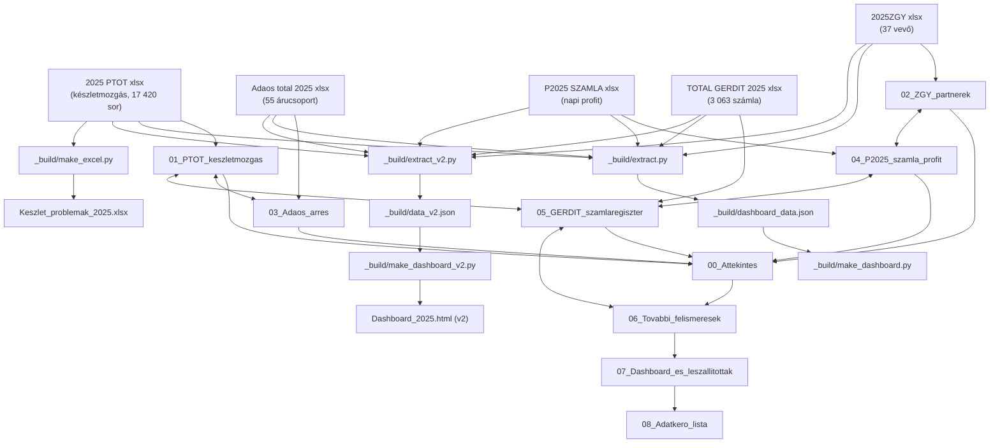

# 00_KNOWLEDGE_MAP — Gergely István projekt

## Domain térkép

### A vállalkozás két értékesítési csatornája

```
Gergely István cég (6 gestiune)
│
├── KISKERESKEDELMI csatorna (kasszás) — ~87,6% forgalom
│   ├── Mért: Adaos total 2025xlsx.xlsx
│   ├── Szintézis: 03_Adaos_arres.md
│   ├── Forgalom (áfa n.): 4 928 463 RON
│   └── Árrés: 1 169 996 RON (~23,7%)
│
└── NAGYKERESKEDELMI / SZÁMLÁS csatorna (factura) — ~12,4% forgalom
    ├── Partner nézet: 2025ZGYxlsx.xlsx → 02_ZGY_partnerek.md
    ├── Idő / profit nézet: P2025 SZAMLAxlsx.xlsx → 04_P2025_szamla_profit.md
    ├── Forgalom (áfa n.): 696 177 RON
    └── Profit: 168 851 RON (24,25%)
```

### Két kiegészítő adatforrás

```
KÉSZLETMOZGÁS (mennyiségi)
  └── 2025 PTOT xlsx.xlsx → 01_PTOT_keszletmozgas.md
      Tartalom: Stoc initial + Intrari − Iesiri = Stoc final (cikkszinten)
      Problémák: 267 negatív zárókészlet, 1 159 holt cikk, 1 022 mozdulatlan sor

SZÁMLA-REGISZTER (tételes, gestiune szerint)
  └── TOTAL GERDIT 2025xlsx.xlsx → 05_GERDIT_szamlaregiszter.md
      IGAZOLT (06_Tovabbi_felismeresek.md): GERDIT = teljes ÉRTÉKESÍTÉS (eladás)
      Adaos kasszás (4 928 463) + P2025 B2B (696 177) = 5 624 640 ≈ GERDIT 5 623 663
      Eltérés: −977 lej (0,017%) — kerekítési ok
```

---

## Adatfolyam — források → pipeline → leszállítottak

```
FORRÁSFÁJLOK (Excel)
  2025 PTOT xlsx.xlsx
  2025ZGYxlsx.xlsx
  Adaos total 2025xlsx.xlsx
  P2025 SZAMLAxlsx.xlsx
  TOTAL GERDIT 2025xlsx.xlsx
        │
        ▼
_build/ PIPELINE v1                         _build/ PIPELINE v2
  extract.py ──────→ dashboard_data.json      extract_v2.py ──────→ data_v2.json
  make_excel.py ───→ Keszlet_problemak.xlsx   make_dashboard_v2.py ─→ Dashboard_2025.html (v2)
  make_dashboard.py → (Dashboard v1)
        │
        ▼
LESZÁLLÍTOTTAK (gyökér)
  Dashboard_2025.html     (offline, 7 tab, drill-down, meta-kategóriák, light/dark, év-kulcsolt)
  Keszlet_problemak_2025.xlsx  (267 negatív + 1 159 holt cikk)
```

---

## Gestiune-térkép

| Gestiune | Jelleg | Cikkszám | GERDIT számlák | GERDIT érték (áfa n.) | Forgási sebesség |
|---|---|---:|---:|---:|---:|
| BIRGITA | bolt | 3 516 | 399 | 1 375 802 RON | 24,9× (leggyorsabb) |
| MUSKATLI | bolt (legnagyobb) | 4 426 | 414 | 1 491 778 RON | — |
| NAGYKERESKEDES | nagyker (B2B motor) | 278 | 1 341 | 660 272 RON | — |
| SZEGEDI | bolt | 3 250 | 389 | 925 533 RON | — |
| VEGYESKE | vegyesbolt | 3 323 | 366 | 891 325 RON | — |
| ZETEKINCSE | bolt (2025-ben nyílt) | 2 620 | 139 | 278 952 RON | 10,6× (felfutóban) |

> Gestiune-jellegek feltételezések a névből — visszaigazolás szükséges (lásd OPEN_QUESTIONS K-02).

---

## Meta-kategóriák — "mire költenek" (IGAZOLT, valós értéken — nem becslés)

| Költési csoport | Forgalom (RON) | % | Árrés% |
|---|---:|---:|---:|
| Friss élelmiszer | 1 726 933 | 35,0% | 24,1% |
| Alkohol & dohány | 1 129 202 | 22,9% | 15,4% |
| Édesség & snack | 570 573 | 11,6% | 26,5% |
| Háztartás & vegyiáru | 493 005 | 10,0% | 25,5% |
| Alap- és száraz élelmiszer | 382 970 | 7,8% | 24,8% |
| Üdítő, víz, kávé/tea | 375 179 | 7,6% | 27,2% |
| Non-food egyéb | 156 136 | 3,2% | 26,3% |
| Egyéb / technikai | 94 467 | 1,9% | 68,7% |

> Forrás: `Szintezisek/07_Dashboard_es_leszallitottak.md` — "Mire költenek" táblázat. Kulcsszavas besorolás, ~74% lefedettség; maradék besorolatlan (adatkérő #3 oldja meg).

---

## Heti ritmus (B2B csatorna — IGAZOLT)

- **Kedd + péntek = szállítónapok**: a B2B forgalom e két napra tömörül.
- Forrás: `Szintezisek/07_Dashboard_es_leszallitottak.md` — "Idő & ritmus" tab leírása.
- Vizualizálva: dashboard v2, 6. tab ("Idő & ritmus").

---

## Szortiment-szerkezet (IGAZOLT)

| Mutató | Érték |
|---|---:|
| Közös szortiment (mind 6 boltban) | 140 cikk |
| Csak 1 boltban jelen lévő cikk | 2 496 cikk |

- Erős lokális kínálat — a boltok szortimentje nagyrészt egyedi.
- Forrás: `Szintezisek/07_Dashboard_es_leszallitottak.md` — "Szortiment" bekezdés.

---

## Tervezési alapelv — ELV

> **"Ne becsülj semmit"** — a dashboardból kikerült a becsült profit/üzlet. Minden megjelenített szám tény. Ahol egy nézet csak hálózati szinten létezik (kategória, partner, B2B), a panel ezt őszintén jelzi.

- Forrás: `Szintezisek/07_Dashboard_es_leszallitottak.md` — "Tervezési elvek"

---

## Cross-referencia háló

```
00_Attekintes
  ↔ 01_PTOT_keszletmozgas   (mennyiségi oldal ↔ érték oldal)
  ↔ 02_ZGY_partnerek        (partner bontás)
  ↔ 03_Adaos_arres          (kasszás árrés)
  ↔ 04_P2025_szamla_profit  (idő bontás)
  ↔ 05_GERDIT_szamlaregiszter (számla-regiszter)
  ↔ 06_Tovabbi_felismeresek (2. kör felismerések)

06_Tovabbi_felismeresek
  ↔ 05_GERDIT_szamlaregiszter  (GERDIT = eladás igazolás)
  ↔ 01_PTOT_keszletmozgas      (készlet-egészség)
  ↔ 03_Adaos_arres             (magas árrésű kategóriák)
  ↔ 02_ZGY_partnerek           (szezonalitás, HoReCa)

07_Dashboard_es_leszallitottak
  ↔ 00_Attekintes              (KPI-k)
  ↔ 06_Tovabbi_felismeresek    (vizualizált felismerések)
  → Dashboard_2025.html        (leszállított, v2)
  → Keszlet_problemak_2025.xlsx (leszállított)
  → _build/ pipeline v1+v2     (reprodukálhatóság)
  ↔ 08_Adatkero_lista          (következő lépések)

08_Adatkero_lista
  ↔ 07_Dashboard_es_leszallitottak  (következő lépés hivatkozások)
  ↔ 00_Attekintes              (projekt kontextus)
  → OPEN_QUESTIONS F-05, F-06, F-07 (adathiányok)

02_ZGY_partnerek ↔ 04_P2025_szamla_profit
  (ugyanaz az értékesítés: 695 612 ≈ 696 177 RON)

01_PTOT_keszletmozgas ↔ 03_Adaos_arres
  (mennyiségi mozgás ↔ értékbeli árrés)

04_P2025_szamla_profit ↔ 05_GERDIT_szamlaregiszter
  (számlás csatorna idősor ↔ gestiune-szintű számla-regiszter)
```

---

## Mermaid — teljes adatfolyam



---

## Kulcsmutatók konzisztencia

### Csatorna-rekonciliáció (IGAZOLT)
- Adaos kasszás: **4 928 463 RON**
- P2025 B2B számlás: **696 177 RON**
- Összeg: **5 624 640 RON**
- GERDIT tételes: **5 623 663 RON**
- Eltérés: **−977 lej (0,017%)** — kerekítési ok; GERDIT = eladás, nem beszerzés

### Árrés konzisztencia
Mindkét csatornán ~24% profit/árrés szint:
- Kasszás: 23,7% (eladási ár alapon) → ~31% a beszerzésre vetítve
- Számlás: 24,25% (eladás alapon)

Ez belső konzisztenciát jelez — az árazási logika egységes.

### Szezonalitás kettéválás (06-ban igazolt)
- **B2B csatorna**: erős nyári csúcs (jún–szept), mély novemberi gödör (27 e lei)
- **Teljes árbevétel**: simább, nyári csúccsal, de nincs novemberi összeomlás (nov: 405 e lei)
- Következtetés: a novemberi gödör kizárólag a B2B csatorna jelensége; a kasszás kisker stabilizálja az évet
