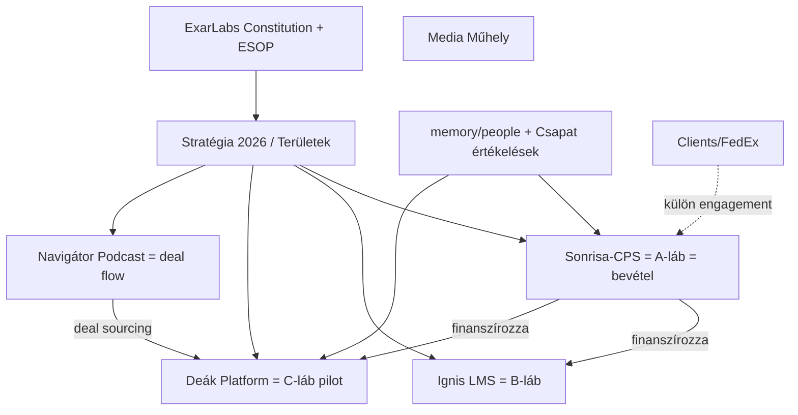

# ExarLabs — Knowledge Map

## Domének és fájlcsoportok

### 1. Stratégia (vízió, irány, célok)
- `Stratégia/Stratégia 2026.md` — aktuális (v0.2)
- `Stratégia/Strategia.md` — három strat. irány elemzés (v0.1)
- `Stratégia/Területek.md` — minden terület mátrixa (v0.2)
- `Stratégia/24 honapos strategiai roadmap.md` — HU roadmap
- `resources/Deák Platform/24-month-roadmap.md` — EN változat (v1.1)
- `resources/ExarGroups/ExarLabs - általános leírás.md` — helyzetkép (v0.1)

### 2. Szervezeti DNS (alkotmány, ESOP, governance)
- `resources/ExarGroups/Constitution of ExarLabs.md` (EN, 2022)
- `resources/ExarGroups/ExarGroups Alkotmánya.md` (HU, 2022)
- `resources/Szervezeti DNS/Exar Stock Ownership Plan.md` (2024)
- `resources/Szervezeti DNS/Exar Döntéshozói Struktúra.md` (2024)

### 3. Outsourcing pillér (A-láb) — Sonrisa / CPS
- `resources/Sonrisa-CPS/Sonrisa general description.md`
- `resources/Sonrisa-CPS/CPS - Introduction - Short.md`
- `resources/Sonrisa-CPS/CPS Constitution.md`
- `resources/Sonrisa-CPS/00. Strategy.md`
- `resources/Sonrisa-CPS/Roadmap.md` (v2.0, €5M ARR)
- `resources/Sonrisa-CPS/BMC v1.3.md`

### 4. SaaS pillér (B-láb) — Ignis Academy / LMS
- `resources/Ignis - LMS/BMC - Ignis Academy - v2.3.md`
- `resources/Ignis - LMS/North Star Metric - KPI - v.2.4.md`

### 5. Equity pillér (C-láb) — Deák Platform
- `resources/Deák Platform/pilot-concept.md` (v1.3)
- `resources/Deák Platform/mvp-spec.md` (v1.2, 7 epic / 37 task)
- `resources/Deák Platform/24-month-roadmap.md` (v1.1)
- `resources/Deák Platform/competitive-advantage.md` (v1.1)

### 6. Network / brand
- `resources/Navigátor Podcast/Küldetés.md` — venture studio deal flow csatorna
- `resources/Media Műhely/Alkotmány.md`
- `resources/Media Műhely/Nyers csomagok.md` — 27 csomag (referencia)

### 7. Csapat
- `memory/people/*.md` — 10 fő, egysoros profilok (Szabolcs E7 + 9 fő, E2–E7)
- `resources/Csapat és Kompetenciák/evaluation-guide.md` — 10 kérdéses Covey-alapú értékelő
- `resources/Csapat és Kompetenciák/szempontok.md` — értékelési szempontok HU
- `resources/Csapat és Kompetenciák/Gábos Levente - Értékelés.md`
- `resources/Csapat és Kompetenciák/Szász Attila - Értékelés.md`
- `resources/Csapat és Kompetenciák/Szabó Andor - Értékelés.md`

### 8. Clients workspace
- `Clients/CLAUDE.md` + `Clients/TASKS.md`
- `Clients/memory/projects/FedEx.md` — indirect FedEx engagement (ExarGroups SRL ← Prototype Iteration ← FedEx)
- `Clients/FedEx/` — ESA + MNDA dokumentumok (docx/doc, nem indexelhetők mélyen)

### 9. Egyéb / orphan-jellegű
- `Anaf.md` — román ANAF jegyzet, kontextus nélkül, 4 sor
- `dashboard.html` (2 példány: root + Clients/) — bináris-jellegű
- `general-utils.plugin` — plugin marker

## Cross-references (domén-szintű)

## Key relationships

- **Sonrisa/CPS dependence:** 100% bevétel (~36k EUR/hó) → minden más láb innen finanszírozódik. Szabolcs CPS-vezető szerepe tartja fenn.
- **Frappe + AI = horizontális szupererő:** mind Deák, mind Ignis erre épül.
- **ExarGroups holding-vízió:** Deák + Ignis + jövőbeli startupok közös ökoszisztéma; ESOP a megtartó eszköz.
- **Navigátor Podcast ≠ marketing:** deal flow csatorna a C-láb startup sourcing-jához.
