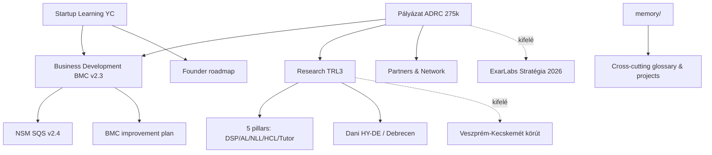

# Ignis Academy — Knowledge Map

## Domain térkép

### 1. Pályázat / EU Grant (ADRC Regio Centru, 275k EUR)
**Központ:** `Pályázat/`
- COD SMIS 348375, "AI-Enhanced Learning Platform"
- Pályázó: EXARGROUPS S.R.L., Administrator: Becze Szabolcs
- Apel PRC/492/PRC_P1/OP1, Acțiunea 1.3.1 "Trecerea de la idee la piață"
- Pontszám: 67/100, won 2025-11-06
- Contestare aktív: 640k RON szolgáltatás + 85k RON bér

**Kulcs fájlok:** `00_README.md`, `02_dokumentumok/DECIZIE_APROBARE_2025-11-06.pdf`, `03_meetings/2025-11-28_Contestare_v1.1.md`

### 2. Business model & metrika
**Központ:** `Business Development/`
- BMC v2.3 (9 building blocks) — Pain/Claim/Gain, B2B SaaS, 5 stakeholder szegmens
- NSM v2.4 — Session Quality Score (SQS 0-100), MAU, MDI, fraud detection
- BMC improve — committed band pricing, skill application rate, scientific authority

### 3. Tudományos alátámasztás (TRL3)
**Központ:** `Research/`
- Five pillars: DSP, AL, NLL, HCL, Tutoring AI Assistant
- Dani HY-DE model (Univ Debrecen) — hyperattention/deep attention pedagógia
- McGilchrist Master/Emissary — LLM bal-agyfélteke megfeleltetés
- Filozófiai/egzisztenciális alapok

### 4. Startup oktatás (YC alapú)
**Központ:** `Startup Learning/`
- YC Startup School (B2B Metrics SRT, Bootstrap vs VC SRT)
- 5-stage learning roadmap
- BMC upgrade plan (10/10 felé)
- Odorheiu előny/hátrány elemzés

### 5. Network & emberek
**Központ:** `Pályázat/08_partners-network/`, `CLAUDE.md`
- Mentors: Ray Lundy, Süket Csaba, Láng Máté
- Academic: Kolumbán Sándor (BBTE), Dani Erzsébet (Debrecen), Simon Károly
- Technical: Miklós Nándi, Szurdi Miki, Szacsúri Laci, Szappanos Norbi
- Admin: Derzsi László, Bustya Attila, Orosz-Pál Levente
- Pilot: Melinda Install (Tóth Károly)

## Cross-references mátrix

| Forrás | Hivatkozik / kapcsolódik |
|---|---|
| `Pályázat/00_README.md` | `../Research/`, `../Business Development/`, `../Startup Learning/`, `../CLAUDE.md`, `../memory/`, `../../ExarLabs/Stratégia/Stratégia 2026.md`, `../../../01_Projects/Szervezet fejlesztés/Veszprém - Kecskemét körút/` |
| `BMC v2.3` | `North Star Metric - KPI - v.2.4`, University of Debrecen PhD, Sonrisa CPS team |
| `North Star Metric v2.4` | BMC v2.3 (SQS = NSM hivatkozás) |
| `How to improve BMC` | BMC v2.3 finomítások (committed band, skill application rate) |
| `Research Areas` | DSP/AL/NLL/HCL/Tutoring → BMC value prop, NSM module pillars |
| `LLM és a bal agyfélteke` | NotebookLM, McGilchrist, narcizmus, 7 Habits |
| `Contestare meeting` | DECIZIE PDF recomandări 1-2 (servicii + tarif orar Becze) |
| `RegioConsult meeting` | TRL3 igazolás, IP brevete, partnership letters (HBC, ITKlaszter) |
| `Networking` | Szovetsegesek (átfedés), Csíkszereda AI workshop (Apáczai ház) |
| `Startup_naplo` | BMC v2.3, NSM v2.4, Networking#Workshop, Contestare meeting |
| `memory/glossary` | minden domain (acronyms, nicknames) |

## Domain kapcsolat (Mermaid)

## Megkülönböztetés (DISTINCT)

- **Ignis Academy** (ez a mappa) = AI-driven enterprise skills platform, ADRC 275k EUR pályázat tárgya
- **Ignis** (`02_Areas/Ignis/`) = DIFFERENT egység, AFM Electromobil tananyag, NEM tartozik a pályázathoz
- **ExarLabs** = anyacég (20% tulajdonos), külön mappa
- **Sonrisa** = ExarLabs partner/parent, CPS csapat, külön mappa
