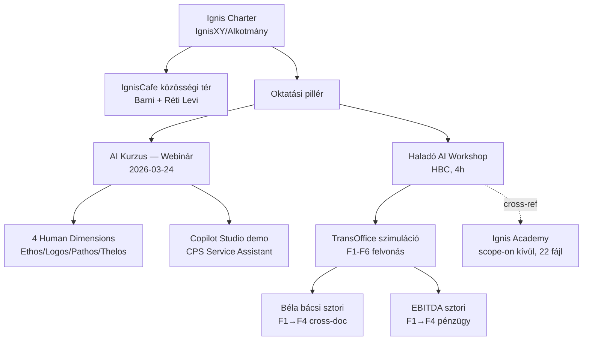

# 00_KNOWLEDGE_MAP — Ignis Domain Map

## Domain-térkép

### 1. Ignis Charter / Vízió (IgnisXY)
**Mag:** "Fényt, meleget, biztonságot adó láng" — oktatási központ + közösségi tér + inspiráció.
**Értékek (5):** Szégyenmentes környezet, Proaktivitás, Folytonos megújulás, Bőségmentalitás, Szolgálat.
**Aktív szál:** IgnisCafe közösségi tér Barni atyával + Réti Levivel (családbarát, keresztény értékalapú tér Udvarhelyen).
**Fájlok:** `IgnisXY/IgnisCafe - Alkotmány.md`, `IgnisXY/Napló.md`

### 2. AI Kurzus — Copilot SMB Webinár (AI Kurzus/)
**Projekt-típus:** időszakos co-branded webinár (Hallenbeck IT + APN Promise + Sonrisa).
**Esemény:** 2026-03-24 10:00, 45 perces Szabolcs-szekció.
**Tartalmi keret:** "4 Human Dimensions" (Ethos/Logos/Pathos/Thelos) — AI tippek időtálló alapelvekre építve, nem feature-listára.
**Output asset-ek:** angol+magyar PDF tananyag, PPTX deck (~45 slide), Copilot Studio agent (CPS Service Assistant) demo, dashboard.html.
**Stakeholderek:** Bianca Alionescu (APN, marketing), Fábián Zsolt (HLB, co-speaker), Gábor Jacob (APN, connector).
**Fájlok:** `AI Kurzus/CLAUDE.md`, `AI Haladó Felhasználás.md`, `EP42 - AI Tips 2.md`, `TASKS.md`, `memory/`, `presentation/`, `resources/Example 1/`

### 3. Haladó AI Workshop — HBC csoport (AI Course HBC/Haladó/)
**Projekt-típus:** önálló 4 órás "Narrated Live Experience" workshop, 10-15 fős HBC csoport.
**Módszer:** 70% élő demo / 20% micro hands-on / 10% szabad próba. Cowork + Obsidian + Markdown mini-OS.
**Narratíva:** TransOffice Trade SRL fiktív cég — kaotikus admin → AFM elektromos autó pályázat (94 oldal) beadása.
**6 felvonás (F1-F6):** F1 fájlrend / F2 meeting+TODO / F3 eligibility+gap / F4 legal+EBITDA+CEO PPT / F5 submission package / F6 web redesign.
**Két kulcs-narratíva-ív:** "Béla bácsi" (bérleti szerződés F1→F4 cross-doc twist) + "EBITDA" (F1→F4 könyvelő-email pénzügyi twist).
**Státusz:** F1-F3 kész, F4 részben (Legal sub-flow ✅, Pénzügy+CEO 🚧), F5-F6 ❌ nem kezdett.
**Fájlok:** `Haladó/CLAUDE.md`, `Preparation/00_STORY_BOOK.md`, `Preparation/01..06_*.md`, `Tananyag/00_Bevezetes/`, `Tananyag/01_Ceg_megertes/`, `Tananyag/02_Meeting_Productivity/`, `Tananyag/03_Dontes_Elemzes/`

## Cross-reference-ek (domain-közi kapcsolatok)

| Honnan | Hova | Kapcsolat |
|---|---|---|
| IgnisXY Alkotmány | AI Kurzus + Haladó Workshop | Mindkét oktatási projekt az Ignis charter "tanulás" pillérét testesíti meg |
| AI Kurzus `AI Haladó Felhasználás.md` (4 dimenzió) | Haladó Workshop `STORY_BOOK` | A 4-dimenzió-keret nincs a workshopban implementálva, de a "humán középpont" elv mindkettőben |
| AI Kurzus `EP42 - AI Tips 2.md` | AI Kurzus `AI Haladó Felhasználás.md` | Forrás-célok: az EP42 podcast vázlat a tippek "honnan"-ját adja |
| AI Kurzus `resources/Example 1/` (CPS docs) | AI Kurzus `memory/projects/copilot-studio-learning.md` | A CPS Service Assistant tudásbázisa |
| Haladó `Preparation/02_*` (master plan) | `Preparation/00_STORY_BOOK.md` | Master plan a technikai, STORY_BOOK a narratív nézet |
| Haladó `Preparation/06_F4_narrativa_legal_plugin.md` | `Tananyag/01_*/szerzodes_chirie_*.docx` + `email_exportok/raspuns_bela_iosif_*.txt` | A Béla bácsi sub-flow narratíva → asset-ek |
| Haladó `Tananyag/01_*/meeting_transcript_20250224.md` | Haladó `Preparation/06_*` | A meeting transcriptben elrejtett Béla bácsi-mondat indítja a F4 Legal twist-et |

## Kapcsolódó scope-on kívüli unit

**"Ignis Academy"** (külön gyökér-mappa, ~22 fájl) — a vault-ban létezik egy önálló unit, ami a Haladó AI Workshop régebbi/párhuzamos verziója lehet. **Nem volt felmérve ebben a futásban (scope kívül).** Lásd `00_GAPS.md` G3.

## Mermaid — domain-térkép

