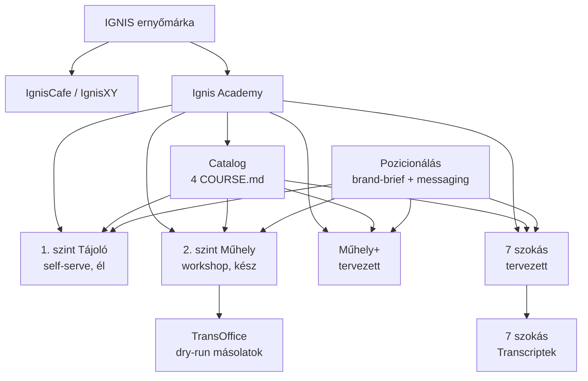

# 00_KNOWLEDGE_MAP — Ignis (scoped)

> Cross-domain térkép: hogyan kapcsolódnak az Ignis területen belüli egységek egymáshoz és a vault más részeivel.

---

## Márka-architektúra

```
IGNIS (ernyőmárka)
├── IgnisCafe (IgnisXY)    — közösségi tér, nonprofit/közösségi jelleg
│   ├── Alkotmány.md       ← vízió, misszió, értékek (2025-12)
│   └── Napló.md           ← alapítási napló (Barni atya felkérése)
│
└── Ignis Academy          — profit-orientált képzések
    │
    ├── [1. vonal] AI-kompetenciák
    │   ├── Tájoló (1. szint)     — mindset, self-serve, belépő
    │   ├── Műhely (2. szint)     — hands-on workshop, core
    │   └── Műhely+ (tervezett)   — specializált haladó
    │
    └── [2. vonal] Szervezetfejlesztés
        └── A 7 szokás (tervezett) — prémium, 1 napos, Covey-alapú
```

---

## Tudás-kapcsolatok (cross-domain)

### 1. Catalog ↔ Tananyagok

A `Catalog/*/COURSE.md` fájlok MARKETING METAADAT szintje, amelyek `lives_in:` linkekkel mutatnak a tényleges tananyagra:

| Catalog fájl | Mutat erre |
|---|---|
| `tajolo/COURSE.md` | `04_Archive/Ignis/AI Kurzus/` + `1. szint/Tananyag/` |
| `muhely/COURSE.md` | `2. szint/Haladó/CLAUDE.md` |
| `muhely-plus/COURSE.md` | (null — még nincs tananyag) |
| `het-szokas/COURSE.md` | `02_Areas/Szervezet Fejlesztés/7 Szokás képzés.md` |

**Elv:** a Catalog csak metaadat-réteg. A tananyag a tényleges tartalomhelyen él.

### 2. Pozicionálás ↔ Catalog ↔ Tananyag

```
brand-brief.md
    └── 03_MESSAGING_ARCHITECTURE.md  (Miller BrandScript, tagline-ok)
            ├── Tájoló pozíció → tajolo/COURSE.md (live)
            ├── Műhely pozíció → muhely/COURSE.md (live)
            └── 05_ERNYO_HIERARCHIA_osszehangolas.md (ernyő-stratégia)
                    ├── muhely-plus/COURSE.md (placeholder)
                    └── het-szokas/COURSE.md (placeholder)
```

### 3. 1. szint ↔ 2. szint (nem szekvenciális!)

**Fontos:** Tájoló és Műhely NEM tanulási progresszió, hanem **két párhuzamos tengely**:
- **Tájoló** = *hogyan gondolkodj* AI-jal (időtálló mindset, Ethos/Logos/Pathos/Thelos keret)
- **Műhely** = *hogyan dolgozz* AI-jal (konkrét eszközpraxis: Claude Cowork + Obsidian)

Cross-sell irány:
- Tájoló → Műhely (vágy felkeltése)
- Műhely → Tájoló (mélyítés, retroaktív értés)

### 4. 7 szokás Transcriptek ↔ Catalog het-szokas

```
7 szokás/Transcriptek/README.md
    ├── 8 × YouTube transcript (8 × .txt + 8 × .hu.srt)
    └── → het-szokas/COURSE.md (felhasználási cél: leírás + agenda)
        └── → 02_Areas/Szervezet Fejlesztés/7 Szokás képzés.md (külső forrás)
```

Az Ignis Academy vault-ban lévő transcript-gyűjtemény **nyersanyag** a tervezett képzéshez. A képzés tényleges tartalmi gyökere a `Szervezet Fejlesztés` Areában van (cross-area hivatkozás).

### 5. Műhely ↔ TransOffice dry-run másolatok

A `2. szint/Haladó/` mappán belül a `TransOffice` fiktív cég adatai több verziós másolatban is jelen van. Ezek a dry-run futtatások "élő" eredményei:

```
Tananyag/TransOffice/          ← KIINDULÓPONT (kaotikus, szándékosan)
TransOfficeCopy/               ← dry-run #1 kimenet
TransOfficeDryRun2.0/          ← dry-run #2 kimenet
TransOfficeCopy_v3/            ← dry-run #3
TransOfficeCopy_v4/            ← dry-run #4
TransOffice_LIVE/              ← aktuális LIVE állapot (94 fájl) ← KANONIKUS
dryrun3/                       ← újabb dry-run (87 fájl)
```

**Összefüggés a Tananyag/ struktúrával:** a `Tananyag/` F1..F6 feladatai ugyanezt a TransOffice-t veszik át a résztvevők — a dry-run másolatok a workshop-facilitátor saját tesztelési munkájának lenyomatai.

### 6. IgnisXY ↔ Ignis Academy (gyenge kapcsolat)

Az IgnisCafe (közösségi tér) és az Ignis Academy (képzések) azonos ernyő alatt, de **eltérő logikával**:
- IgnisCafe: közösségi, nonprofit jellegű, Barni atya + Réti Levi kollab
- Ignis Academy: profit-orientált, B2B/B2C képzések

A Napló.md felveti a kérdést: „nem is önfenntartó [az Ignis Academy]... Talán az Ignis jövője?" — jelezvén, hogy a két ág kapcsolata és jövője stratégiai kérdés.

---

## Vault-on kívüli kereszthivatkozások

| Kapcsolat | Hol | Mit |
|---|---|---|
| Covey forrás | `02_Areas/Szervezet Fejlesztés/7 Szokás képzés.md` | 7 szokás képzés forrása |
| Tájoló EN forrás | `04_Archive/Ignis/AI Kurzus/28_AI_Tips_Course_Material_EN.md` | angol tananyag |
| Archív prezentáció | `04_Archive/Ignis/AI Kurzus/presentation/` | eredeti diasor archívuma |
| SaaS platform (B2B) | `02_Areas/Ignis Academy/` | EU-pályázatos SaaS platform (FIGYELJ: más entitás!) |
| Navigátor EP42 | `02_Areas/Navigátor Podcast/` | Tájoló anyag ott indult (CTA hivatkozás) |
| Sonrisa co-brand | (Sonrisa Area) | Webinar co-brand partner (2026-03-24) |

---

## Területi térkép (Mermaid)


