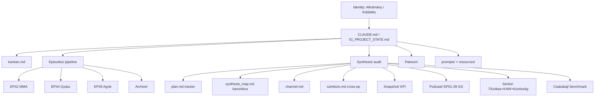

# Navigátor Podcast — Knowledge Map

> Domain-térkép: a unit tudásrétegei, kapcsolatok és cross-referenciák. A struktúra 5 fő réteget követ.

## 1. Identitás & stratégia (gyökér)

| Réteg | Fájlok |
|-------|--------|
| Vízió / Misszió / Értékek | `A Navigátor Podcast Alkotmánya.md`, `Küldetés.md`, `memory/projects/navigator-podcast.md` |
| Projekt-szintű AI memória | `CLAUDE.md`, `01_PROJECT_STATE.md` |
| Operatív kanban | `kanban.md` |
| Workflow | `memory/context/workflow.md`, `Synthesis/new_video_checklist.md` |
| Egyéb gyökér | `Utils.md`, `patterns.md` (56KB), `Navigator_YouTube_MCP_Documentation.pdf` |

## 2. Epizód-pipeline (Episodes/)

### Élő (Episodes/ — nem-archive)
- **EP42 – Yda Gabi & Kovács Krisztián (MMA):** SRT készen, 5 verzió kérdéssor (`kérdések.md` → `_v5.md`), deep-research-report, 2 thumbnail variáns. Status: SRT kész, feldolgozásra vár.
- **EP44 – Farkas Kinga (Gyász):** meghívó + felkészülési kérdések pdf/docx + ChatGPT jegyzet. ⚠️ vendég felkérés lejárt határidőn.
- **EP45 – Miklós Ervin (Agrárdigitalizáció):** meghívó + kérdéssor pdf/docx + `Kerdessor.md`. Tervezett.
- **Plugin segédanyag:** `Episodes/Navigátor Podcast Plugin/scripts/` + `EP41 - ChatGPT jegyzetek.md`.

### Archive (Episodes/Archive/)
EP31, EP34, EP36, EP37 single-md jegyzetek; EP38 / EP39 / EP41 (Eberlein) / EP41 (Fegyelem = szabadság, 9 részes jegyzet-szett) workspace-ek; EP42 webinar / AI képzés (`ai_learning_material_v0.1`–`v0.4`); Digitális Székelyföld régi sub-series (7 jegyzet); Pistyur Veronika offline kihagyott.

## 3. Csatorna-audit & szintézis (Synthesis/)

### Tracking + master
- **`plan.md` (v0.6):** epizód-szintézis mátrix, fázis-tábla (1–4a/4b/4c), DoD, döntésnapló (15 döntés), gyökér-fájl státuszok, törlendők lista.
- **`synthesis_map.md` (v3.1):** kanonikus EP-szám ↔ YouTube cím ↔ link ↔ view ↔ PopScore (40 podcast + 16 sorozat + clips + egyéb).
- **`channel.md` (v0.1):** csatorna-szintű összesítő, TOP 15 videó, demográfia, traffic-source.
- **`szintézis.md` (1035 sor):** cross-episode megfigyelések, hipotézisek (közönség-divergencia, hook-probléma, FB-forgalom, stb.).

### Audit + re-optimalizálás
- `Csatorna Audit Terv v0.4.md` — audit terv + új-videó audit sablon
- `Navigátor Podcast — Videó Re-optimalizálási Terv.md` — Fázis 4a részletes
- `cards_and_pinned_comments_plan.md` (Pinned Comments 62/62 ✅)
- `end_screen_plan.md`
- `EP41_EP42_scoring.md`, `EP42_MMA_YouTube_Metadata.md`, `EP42_hook_javaslatok.md`

### Modell-fájlok
- `hostscore_v1.0_model_universal.md`
- `popscore_v1.5_model.md`, `popscore_v1.5_model_universal.md`

### Snapshot
- `Snapshot/SNAPSHOT_RULES.md` (v1.0) — heti KPI snapshot szabályok
- `Snapshot/SNAPSHOT_2026-04-09.md` — baseline (post-optimization)

### Engine
- `ENGINE.md` (26KB) — szintézis-motor (most már `episode-synthesis-v0-3` skill-ben élő)

### Per-epizód szintézisek
- **Podcast/EP01–EP39** (39 Gold Standard fájl) — hiányzik EP40 szintézis (publikált 2026-04-10, jelölve plan.md-ben).
- **Series/** — 7 Szokás 8 db, KAW 5 db, Közösség 3 db.

### Csakabaj benchmark
- `Csakabaj/synthesis_map.md` — 51 epizód, S1 (EP01-EP26) + speciális (EP27-EP33) + valószínűleg további szezonok.
- `Csakabaj/Episodes/` — 51 individuális synthesis fájl (`CSAKABAJ_S01E21–E26` + `EP01–EP51` keverten).

## 4. Patreon

- `Patreon/Patreon Kampányterv 2026.md` — 4 → 25 fizető tag, 4 hetes kampány, 3 szegmens.
- `Patreon/EP04–EP06.md` — Patreon-exkluzív epizód jegyzetek (férfivá nevelés, startupok, fegyelem).

## 5. Eszközök & promptok

- `prompts/Genreal.md`, `prompts/Prompt to generate title and description.md`, `prompts/reel-generator.md`
- `resources/Navigátor Podcast Meghívó Template.docx`
- WP-sorozat metadata munkacsomagok a gyökérben (`WP39`, `WP40`, `WP40_Final`, `WP41`) — különálló publikálási munkacsomagok EP39–EP41-hez.

## Cross-references (scope-on belül)

- `CLAUDE.md` ↔ `01_PROJECT_STATE.md` — egymást kiegészítik (memory vs. snapshot).
- `01_PROJECT_STATE.md → Project Map` — felsorolja a kulcs Synthesis/ fájlokat, de jelzi: "néhány fájl session-ben volt, újragenerálandó" → ezek azóta léteznek (✅), CLAUDE.md táblája viszont még "❌ Újragenerálandó"-ként listázza őket (lásd GAPS).
- `Synthesis/plan.md ↔ Synthesis/synthesis_map.md` — plan.md kanonikus EP-számozást a synthesis_map.md v3.0+-ból veszi.
- `Synthesis/Podcast/EP[XX]` → `Synthesis/szintézis.md` — egyedi szintézisek táplálják a cross-episode dokumentumot.
- `Synthesis/new_video_checklist.md ↔ Csatorna Audit Terv v0.4.md (3. pont)` — checklist a sablon operacionalizálása.
- `Episodes/EP44/EP45` → `resources/Navigátor Podcast Meghívó Template.docx` — meghívó-pipeline alapja.
- `WP39/WP40/WP41_*_YouTube_Metadata.md` (gyökér) ↔ `Episodes/Archive/EP38/EP39/EP41_youtube_metadata.md` — overlap (legacy metadata workpackage vs. archive snapshot).

## Mermaid — fő tudásrétegek

