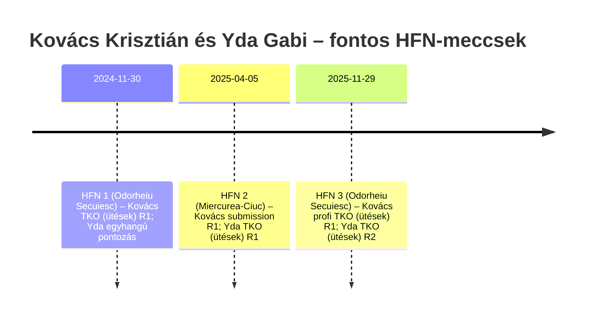

# Podcast-előkészítő dosszé: és –

## Vezetői összefoglaló

A nyilvánosan elérhető, elsődleges jellegű adatbázisok (harci rekordok és eseményoldalak), valamint a helyi sportmédia alapján mindkét vendéged stabil „helyi arc” a gálán: **Kovács Krisztián** a sorozat három eddigi eseményén három győzelmet szerzett (ebből 1 profi), míg **Yda Gabi** háromszor lépett ketrecbe és mindháromszor nyert amatőr szabályrendszerben. citeturn14view1turn14view0turn20view0

A podcast szempontjából különösen erős alapanyag, hogy a rekordok „történetként” olvashatóak: Kovácsnál gyors TKO-k (ütések) és egy villámgyors submission is van, vagyis a beszélgetésben könnyen előjöhet a „minden dimenzióban harcos” narratíva (állóharc–földharc–felkészülés). citeturn14view1turn15search4 Ydánál a három győzelem két stoppage (ütésekkel, rövid idővel) és egy egyhangú pontozás – ez jó kapu a „tempó vs. türelem” témához. citeturn22view3

Fontos korlát: **életkor, magasság, hivatalos klub/edző** mindkét harcosnál hiányzik a nyilvános rekordoldalakról, ezért ezeket nem érdemes „tényként” kezelni. Inkább: gyors, egyszerű on-air tisztázó kérdésekkel (1–2 perc) beemelni, így a hallgató is azonnal képet kap. citeturn14view1turn14view0turn15search4

A fegyelem dimenziójához Kovács esetében van erős, konkrét kapaszkodó: egy helyi interjúban részletesen beszél napi 3–4 edzésről, edzéstípusokról, regenerációról és fogyasztásról (84 kg → 70 kg). citeturn18view0 Yda esetében kevesebb az ilyen jellegű, nyilvános, „mondatról mondatra” idézhető anyag; ezért nála a beszélgetés sikerét inkább a jól megtervezett sztorikérdések adják (lent adok konkrét, nem intellektuális megfogalmazásokat).

## Alapadatok és megbízhatósági audit

Az alábbi táblázat **csak igazolható elemeket** tartalmaz (rekordok, súlyok, események). A hiányzó mezőket külön jelzem.

| Attribútum | Kovács Krisztián | Yda Gabi |
|---|---|---|
| Nyilvános életkor | Nem szerepel a fő rekordoldalakon (N/A). citeturn14view1turn15search4 | Nem szerepel a fő rekordoldalakon (N/A). citeturn14view0 |
| Hivatalos/nyilvános klub (MMA) | Nem szerepel a fő rekordoldalakon (N/A). citeturn14view1 | Nem szerepel a fő rekordoldalakon (N/A). citeturn14view0 |
| Nyilvános edző/coach | Több edzőtípust említ (BJJ, birkózás, ökölvívás, MMA, kick-box), de nem „egy klub–egy vezetőedző” formában. citeturn18view0turn22view0 | Nem találtam elsődleges, névvel vállalt edző-megjelölést a rekordoldalakon. citeturn14view0 |
| MMA rekord (Tapology) | 1–0 profi + 2–0 amatőr (mind HFN). citeturn14view1turn15search4 | 3–0 amatőr (mind HFN). citeturn14view0 |
| HFN-szereplések (dátumok) | 2024-11-30; 2025-04-05; 2025-11-29. citeturn14view1turn25view0 | 2024-11-30; 2025-04-05; 2025-11-29. citeturn14view0turn25view0 |
| Súlyok (HFN-ben) | 170 → 185 → 155 (váltás több súlyban). citeturn14view1 | 176 (80 kg) → 170 → 170. citeturn22view3turn21view0 |
| Stabil „beszélgetéshez jó” tények | (1) Többszörös országos birkózóbajnokból váltott MMA-ra. citeturn22view0 (2) Napi 3–4 edzés + erős regenerációs fókusz. citeturn18view0 | (1) A helyi közönség egyik kedvence; több helyi beszámoló kiemeli az ovációt és a „nem okozott csalódást” narratívát. citeturn22view1turn17view2 |

**Megjegyzés a klub/edző kérdéshez:** találhatóak közösségi posztok és utalások (pl. edzőtermek, BJJ-s közösségek), de a platform-hozzáférés a kutatás közben többször korlátozott volt (throttling), ezért ezeket **nem emelem „biztos adat” szintre**. A legjobb megoldás: on-air megkérdezni, majd a show notes-ban pontosítani.

## Karierek és stílusprofilok a Harghita Fight Night alapján

**Kovács Krisztián – hárommeccses „progressziós történet”:**
- **HFN 1 (2024-11-30, Odorheiu Secuiesc):** TKO (ütések), 1. menet 1:44 – gyors, domináns kezdés. citeturn14view1turn15search4turn21view0  
- **HFN 2 (2025-04-05, Miercurea-Ciuc):** submission, 1. menet 0:51 – nagyon rövid, földharc-fókuszú befejezés. citeturn14view1turn14view2turn17view1  
- **HFN 3 (2025-11-29, Odorheiu Secuiesc):** **első profi meccs** – TKO (ütések), 1. menet 4:05; helyi beszámoló „villámgyors, látványos kiütésről” ír. citeturn22view1turn22view2turn14view1  

**Stílus-következtetés (óvatos, minta kicsi):** a befejezések típusa (ütések + submission) alapján Kovács **nem egysíkú**, és valószínűleg komfortos a ketrec több fázisában is. Ezt erősíti a birkózói múlt és az a saját leírás, hogy az MMA több szakág tudását igényli (2–4 edzés/nap). citeturn22view0turn18view0

**Yda Gabi – „tempó + közönségkedvenc + kétszer korai stoppage”:**
- **HFN 1 (2024-11-30, Odorheiu Secuiesc):** egyhangú pontozás – 3 menet, tehát ott jött a „végigmenni és kontrollálni” tapasztalat. citeturn22view3turn21view0  
- **HFN 2 (2025-04-05, Miercurea-Ciuc):** TKO (ütések), 1. menet 2:12. citeturn22view3turn14view2turn17view1  
- **HFN 3 (2025-11-29, Odorheiu Secuiesc):** TKO (ütések), 2. menet 0:21; helyi tudósítás kiemeli a közönség reakcióját és hogy „felülkerekedett a lengyel vetélytárson”. citeturn22view3turn22view1turn17view3  

**Stílus-következtetés (óvatos):** Yda rekordja alapján valószínű, hogy **képes gyorsan „rátolni a tempót”** (két TKO ütésekből, rövid idővel), miközben van tapasztalata pontozásos menetelésben is. citeturn22view3


A fenti idővonal a Tapology rekord- és eseményadataiból készült. citeturn14view1turn14view0turn14view2turn22view2turn25view0

**Illusztratív meccslinkek (jó „háttérnézésre” vagy epizód előtti hangolásra):** teljes meccsek/hivatalos feltöltések elérhetők (legalább HFN 1–3 kulcspárosítások). citeturn0search25turn0search28turn0search23turn0search26turn15search0

## Beszélgetési dimenziók: fegyelem, fókusz, bátorság, alázat és eredettörténet

A te koncepciód („harcos” mint fegyelem–fókusz–bátorság–alázat) akkor tud a legjobban működni két nem feltétlenül intellektuális beállítottságú vendéggel, ha **mindig konkrét cselekvésekből és helyzetekből** indulsz: egy nap, egy edzés, egy meccsnap, egy sérülés, egy vereség/győzelem, egy konfliktus.

**Fegyelem (testi dimenzió) – amit biztosan tudunk, és amit érdemes megkérdezni**
- Kovács egy helyi interjúban nagyon konkrét napirendet mond: „három-négy edzés naponta”, reggel erőnlét, délelőtt MMA/állóharc, délután jiu-jitsu vagy birkózás; hétvégén sparring és utána regeneráció (szauna/gyógyfürdő/masszázs); hangsúly a diétán. citeturn18view0  
- Ugyanebben a kontextusban beszél arról is, hogy a profi debütálás miatt 84 kg-ról 70 kg-ra kellett mennie (14 kg), és ezt kihívásként írja le. citeturn18view0  

Podcast-szempontból itt két, tudományosan is „biztonságos” fókuszpont van:
1) **Periodizáció/életmód:** egy friss, hivatalos állásfoglalás szerint a felkészülés külön fázisai (off-camp / fight camp / fight week) eltérő táplálkozási és súlymenedzsment stratégiát igényelnek. citeturn20view5  
2) **Fogyasztás kockázata:** a súlycsökkentéshez használt dehidratáció (akár mérsékelt is) növelheti az akut kardiovaszkuláris kockázatokat, és felvetik a fejsérülés-rizikó növekedését is (kevesebb „párnázás” a koponya körül). Ezt nem „riogatásra”, hanem felelős, praktikus beszélgetésre érdemes használni. citeturn20view6  

**Fókusz (kognitív/figyelmi dimenzió) – figyelemfegyelem civil és ketrec-helyzetben**
- Kovács beszél „külön taktikáról” és arról, hogy fizikálisan-mentálisan-technikai értelemben készül több harctávolságra. Ez jó belépő a „mi van a fejedben a ringbe lépés előtti 10 percben?” kérdéshez. citeturn18view0  
- A hazai közönség nyomását is megnevezi: „egészséges teher és nyomás” van rajta, mert bizonyítani kell. citeturn18view0turn17view0  

A sportpszichológiai irodalom alapján (MMA-s specifikus áttekintés) a sportban a mentális jellemzők és mentális technikák fontosak a teljesítményhez, és a témák közt visszatér a motiváció, önbizalom, hangulat, társas hatások kérdése. citeturn20view8 Ezt lefordítva: *„Mi segít, hogy a te fejed ne „szaladjon el”?”* – és kész.

**Bátorság (érzelmi dimenzió) – félelem, szégyen, kudarc**
Közvetlen, nyilvános forrásból nem találtam dokumentált „trash talk botrányt” vagy nyílt megalázási ügyet róluk a HFN környezetében. Ilyenkor a legjobb stratégia az, hogy **nem rájuk húzod rá** ezt a narratívát, hanem *szituációként* kérdezed:
- „Volt olyan, hogy az ellenfél beszélt? Téged ez felhúz vagy hidegen hagy?”  
- „Mi rosszabb: kikapni, vagy úgy nyerni, hogy szégyelled a teljesítményt?”

A verseny előtti szorongás a küzdősportokban tipikus; egy (küzdősportos mintán végzett) tanulmány szerint a mentálisan „keményebb” sportolók alacsonyabb kognitív/szomatikus szorongást és magasabb önbizalmat mutatnak verseny előtt. citeturn20view7 Ez ad egy nagyon egyszerű, jó kérdésmagot: *„Mitől vagy nyugodt – és mitől borulsz?”*

**Alázat (társas/spirituális dimenzió) – erőkontroll, közösségi szerep**
A helyi tudósításokból két kapaszkodó van:
- Mindkettőjüket „helyi” karakterként, közönségkedvencként írják le; Ydát kifejezetten nagy ovációval fogadták. citeturn22view1turn17view2  
- Kovács több megnyilatkozásban köszöni a szervezői csapat munkáját, és „maradandót alkotni” jellegű célt fogalmaz meg. citeturn17view1  

Innen lehet alázatra kötni, moralizálás nélkül:
- „Mit jelent neked, hogy a város tapsol? Miben trappolsz el ilyenkor óvatosan, hogy ne szállj el?”  
- „Hol kell visszafogni az erőt? Edzésen? Utcán? Otthon?”

**Eredettörténet és „fizikum” – veleszületett vagy felépített?**
- Kovácsnál dokumentált a birkózói háttér és egy 2019-es felnőtt bajnoki helyezés említése; ez a „gyerekkor óta sport” narratívát támogatja. citeturn22view0  
- Ydánál nyilvános rekordadat van (3–0 HFN), viszont kevesebb a részletes háttér-interjú; itt érdemes a kérdést úgy feltenni, hogy *„volt-e töréspont, mikor kezdett komolyan formát ölteni a tested?”* (lásd kérdésbank). citeturn14view0turn22view3  

## Helyi kontextus: Harghita Fight Night és a székelyföldi küzdősport-szcéna

A gálasorozat – a nyilvános promóteradatok szerint – entity["city","Székelyudvarhely","harghita, ro"] központtal működik, és az ismert események helyszínei közt szerepel a helyi sportcsarnok, illetve a entity["city","Csíkszereda","harghita, ro"]-i aréna. citeturn25view0turn20view1turn14view2

A nemzetközi adatbázisok szerint eddig három eseményt tartottak (HFN 1–3), és ezek helyszínként Odorheiu Secuiesc/Székelyudvarhely, illetve Miercurea-Ciuc/Csíkszereda köré szerveződnek. citeturn20view1turn25view0 A streaming-oldal leírása szerint a koncepció: helyi és külföldi harcosok, a sport és sportszerűség jegyében, és a vegyes harcművészet „bemutatása” a közönségnek. citeturn20view2

A helyi beszámolók a hangulatra külön ráerősítenek: az első udvarhelyi gálán teltház-közeli állapot, kivetítők, bevonulások, fény/hang, és még jótékonysági gyűjtés is megjelent a programban. citeturn17view2turn21view0

image_group{"layout":"carousel","aspect_ratio":"16:9","query":["Harghita Fight Night Odorheiu Secuiesc Sala Sporturilor","Erőss Zsolt Aréna Miercurea Ciuc","mixed martial arts cage event Romania Harghita","Székelyudvarhely sportcsarnok Sala Sporturilor"],"num_per_query":1}

**Terjeszkedés és friss fejlemény:** egy 2026. március 10-i helyi cikk szerint a negyedik HFN-eseményt 2026. április 25-én entity["city","Kecel","bacs-kiskun, hu"]ben rendeznék meg, a Vikker Dániel-emlékverseny keretében; 15–16 mérkőzést említenek, és online közvetítés is várható. citeturn19view0 Ez podcastban „aktuális” kampó: *„Honnan jött az ötlet, hogy átviszitek Magyarországra?”*

**Jegy- és helyszín-specifikus források:** a jegyoldalak a HFN 1-hez időpontot és helyszíncímet is adnak (Sportcsarnok, Strada Bányai János 1–3; 2024-11-30 18:00). citeturn20view4turn21view0

## Praktikus podcast-csomag: sztorik, kérdések, follow-upok, epizódstruktúra, forráslinkek

**Javasolt epizódszerkezet (kb. 60–75 perc, „maszkulin–praktikus–sztoris” hang):**
- **Hideg nyitás (1–2 perc):** 1 mondat a tétre: „mi történik a fejben és a testben, amikor be kell menni a ketrecbe?” + egy gyors eredmény-morzsa (pl. „három HFN-meccs, három győzelem”). citeturn14view1turn14view0  
- **Gyors bemutatás (5 perc):** „Ki vagy, mióta, milyen súlyban?” (csak tények, egyszerűen).  
- **Fegyelem blokk (15–20 perc):** napirend, kaja, regeneráció, fogyasztás, sérülés. Kovácsnál itt be lehet hozni a konkrét napirendet és a 14 kg fogyást. citeturn18view0  
- **Fókusz blokk (10–15 perc):** meccsnap, ringbejárás, bemelegítés, „mi fér bele a fejedbe?”  
- **Bátorság blokk (10–15 perc):** félelem, szégyen, kudarc, újrakezdés. (Nem „pszichológia”, hanem konkrét helyzetek.) citeturn20view7  
- **Alázat/küldetés blokk (10 perc):** erőkontroll, példamutatás, közönség, fiatalok, közösség. citeturn17view1turn22view1  
- **Zárás (3–5 perc):** „1 mondat a 16 éves énednek” + „mi a következő cél/meccs/edzés?” (aktuális horgony: 2026.04.25 Kecel). citeturn19view0  

### Rövid sztoripromptok (anekdotákhoz, „meséld el”-típus)
1) „Meséld el azt a napot, amikor semmi kedved nem volt felkelni, mégis megcsináltad.”  
2) „A legrosszabb edzésed az elmúlt 3 hónapból – mi történt, és mi lett a tanulság?”  
3) „A legjobb sparring-sztori: mikor érezted, hogy átbillent valami?”  
4) „Egy konkrét kaja-kísértés sztori: mikor buktál el, és mit csináltál utána?”  
5) „Sérülés-sztori: mi volt a legidegesítőbb rész, és hogyan raktad rendbe fejben?”  
6) „Meccs előtti utolsó 60 perc – percről percre, kábé.”  
7) „Első ütés, ami igazán megütött – mikor volt, és mit csináltál?”  
8) „Egy pillanat, amikor elment a fókusz – és hogyan hoztad vissza?”  
9) „A legnagyobb taps, amit kaptál – mit csinált veled?” citeturn22view1turn17view0  
10) „A legnagyobb pofon (nem szó szerint): egy nap, amikor nem jött össze – hogyan álltál fel?”

### Húsz célzott interjúkérdés (praktikus, nem intellektuális nyelven)

1) „Hánykor kelsz fel egy átlagos edzésnapon?”  
2) „Mi az első 3 dolog, amit megcsinálsz reggel?”  
3) „Mi a ‘nem tárgyalható’ rutinod? Amit akkor is megcsinálsz, ha nulla kedved van.”  
4) „Hogy néz ki egy napod edzésben? (reggel–dél–este)” citeturn18view0  
5) „Mi az az egy dolog, amin a legtöbbet spórolnál időben, de nem lehet?”  
6) „Mi a legnehezebb a kajában: mennyiség, minőség, édesség, vagy a ‘csak még egy falat’?”  
7) „Fogyasztásnál mi az a pont, amikor már fejben is harc?” citeturn18view0turn20view6  
8) „Mi volt a legdurvább 10 perc edzésen, amit mostanában átéltél?”  
9) „Ha fáradt vagy, mit csinálsz: erőből tolod, vagy okosabban edzel?”  
10) „Mihez nyúlsz regenerációra: alvás, szauna, masszázs, fürdő?” citeturn18view0  

11) „Meccsnapon mit eszel-iszol, és mikor?”  
12) „Mikor kezded el ‘lezárni a világot’ meccs előtt?”  
13) „Mi az a külső dolog, ami a legjobban szét tud szedni fejben?”  
14) „Mi az a mondat vagy gondolat, ami visszahoz fókuszba?” citeturn18view0turn20view7  
15) „Félsz-e meccs előtt? Ha igen: mitől pontosan?”  
16) „A félelem mikor tűnik el: bevonulásnál, első ütésnél, vagy soha nem tűnik el?”  
17) „Ha vesztésre állsz, mi az első dolog, amit fejben rendbe raksz?”  
18) „Mit csinálsz a vereség/hibázás utáni első 24 órában?”  
19) „Az utcán érzed, hogy máshogy néznek rád? Mit csinálsz ezzel?”  
20) „Kiknek akarsz példát mutatni – és miben?” citeturn17view1turn20view2  

### Tíz follow-up fegyelmi témára
1) „Konkrétan mi volt a tegnapi menüd?”  
2) „Mit eszel, amikor nagyon ráállnál a szemétkajára?”  
3) „Mi az a kaja, amit teljesen elhagytál?”  
4) „Melyik edzésed a legutáltabb, de a leghasznosabb?”  
5) „Mi a trükköd, hogy ne maradj ki 2 nap és ne csússz szét?”  
6) „Ha 30 perced van edzeni, mit csinálsz?”  
7) „Mi volt a legbutább sérülésed, és mit tanultál belőle?”  
8) „Hogy néz ki nálad a ‘pihenőnap’? Tényleg pihenő?”  
9) „Alvás: hány óra az ‘ideális’, és mennyi a valóság?”  
10) „Mi az egy kiegészítő/szokás, ami sokat dobott a regeneráción?” citeturn18view0turn20view5  

### Tíz follow-up fókusz témára
1) „Mi a leggyakoribb ‘fejben szétesés’ nálad?”  
2) „Zene: hallgatsz bevonulás előtt? Miért?”  
3) „Kivel beszélsz utoljára meccs előtt?”  
4) „Telefon: tiltod meccsnapon?”  
5) „Mi az a vizuális kép, ami segít?”  
6) „Mi az a szó, amit edzőtől/társtól hallasz és azonnal kapcsolsz?”  
7) „Volt olyan, hogy túl akartál bizonyítani a hazai közönségnek?” citeturn18view0turn17view0  
8) „Mi a ‘B-terv’, ha az első taktika nem működik?”  
9) „Mit csinálsz, ha az ellenfél nagyon más, mint vártad?”  
10) „Ringben: mire figyelsz először – kezek, lábak, távolság, légzés?”  

### Tíz follow-up bátorság témára
1) „Mi a legnagyobb félelmed: sérülés, vereség, megszégyenülés, vagy valami más?”  
2) „Mi a tested jelzése félelemnél? (gyomor, kéz, légzés)”  
3) „Van-e olyan emléked, ami meccs előtt beugrik?”  
4) „Mi volt a legnagyobb ‘nem akarok ott lenni’ pillanatod?”  
5) „Mi a legnagyobb dicséret, amit kaptál magadtól?”  
6) „Mi a legnagyobb szégyen, amit sportban átéltél – és mi lett belőle?”  
7) „Hogy néz ki nálad a ‘vesztettem, de visszajövök’ nap?”  
8) „Mi volt a legjobb tanács, amit vereség után kaptál?”  
9) „Trash talk: téged ez felpörget vagy lehúz?”  
10) „Mit csinálsz, ha a bíró/nézők/ellenfél igazságtalannak tűnnek?” citeturn20view7  

### Tíz follow-up alázat témára
1) „Mit jelent nálad az, hogy ‘erős vagyok, de nem bántok’?”  
2) „Volt olyan, hogy vissza kellett fogni magad az utcán?”  
3) „Mitől lesz valaki ‘igazi harcos’, ha a ketrecen kívül nézzük?”  
4) „Ki az, akinek te tartozol hálával a sportban?” citeturn17view1turn17view0  
5) „Mit tanít neked a közönség szeretete – és mitől veszélyes?”  
6) „Milyen példát akarsz mutatni a gyerekeknek?”  
7) „Mit üzensz annak, akit csúfolnak az iskolában?”  
8) „Mit üzensz annak, aki azt mondja: ‘neked könnyű, jó genetikád van’?”  
9) „Mi a hosszú távú cél: öv, profi karrier, edzősködés, vagy valami más?”  
10) „Ha holnap abbahagynád a küzdősportot, mi maradna belőled: milyen ember?”  

### Kulcsforrások és linkek (ellenőrizhető, elsődleges/kvázi elsődleges)
```text
Tapology – Hargita Fight Night promóteroldal: https://www.tapology.com/fightcenter/promotions/5802-hargita-fight-night-hfn
Tapology – Kovács Krisztián fighter page: https://www.tapology.com/fightcenter/fighters/477782-krisztian-kovacs
Tapology – Gabor Yda fighter page: https://www.tapology.com/fightcenter/fighters/477758-gabor-yda
Sherdog – Hargita Fight Night organization: https://www.sherdog.com/organizations/Hargita-Fight-Night-18679
Vicket – HFN csatorna (leírás + VOD-ok): https://sport.vicket.com/hargitafightnight
Visit Harghita – HFN 2024 eseményoldal (program): https://visitharghita.com/hu/events/hargita-fight-night
Cooltix – Hargita Fight Night 2024 jegyoldal: https://cooltix.com/ro/event/66ffa6b7b260dad47d0fb2d3

Székely Sport – Kovács felkészülés/napirend/fogyasztás (2025-11-25):
https://sport.szekelyhon.ro/egyeb-sportok/kovacs-krisztian-meg-kell-mutassuk-hogy-igenis-van-helyunk-a-ringben
Székely Sport – HFN terjeszkedés (Kecel, 2026-04-25):
https://sport.szekelyhon.ro/egyeb-sportok/terjeszkednek-az-anyaorszagban-is-bemutatkozik-a-hargita-fight-night

ISSN állásfoglalás (PMC) – táplálkozás + weight cut stratégiák (2025):
https://pmc.ncbi.nlm.nih.gov/articles/PMC11894756/
MDPI Sports áttekintés – weight cutting kockázatok (2019):
https://www.mdpi.com/2075-4663/7/5/123
```

**Záró szerkesztői megjegyzés (a beszélgetés minőségére):** a fenti anyagból az látszik, hogy az epizód akkor lesz igazi „hallgattatós”, ha **mindig sztorira kérsz** (mikor, hol, mit csináltál, mit mondtál magadnak), és csak a végén vonod le a tanulságot 1 mondatban. A rekordok és a helyi közeg sztorivá alakítható – a te kereted (fegyelem–fókusz–bátorság–alázat) pedig pont elég stabil ahhoz, hogy ne csússzon szét a beszélgetés. citeturn14view1turn14view0turn17view2turn20view2