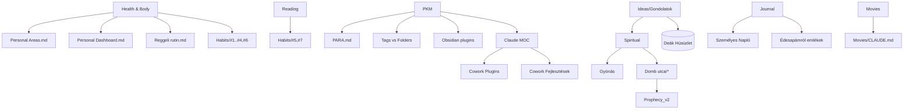

# 00_KNOWLEDGE_MAP — Personal Growth

## Domain clusters

### 1. Health & body tracking
- `Personal Areas.md` — weight EMA-14 trend, pulls from `05_DailyNotes`
- `Personal Dashboard.md` — weight chart (90-day window)
- `Reggeli rutin.md` — morning routine research (electrolytes, light, cold, caffeine timing)
- `Habits/#1 🌅` wake-up, `#2 💊` supplements, `#3 🏃` running, `#4 🧊` cold, `#6 📊` tracking

### 2. Reading & learning habits
- `Habits/#5 📖`, `Habits/#7 📚` — two reading-related trackers
- `PKM/Obsidian plugins.md` — reading/annotation plugin candidates

### 3. PKM methodology
- `PKM/PARA.md` — PARA model
- `PKM/Tags vs. Folders.md` — tagging best practices
- `PKM/Obsidian plugins.md` — tool inventory
- `PKM/Claude/*` — Claude/Cowork sub-cluster

### 4. Claude / Cowork tooling
- `PKM/Claude/Claude MOC.md` (hub) → `Cowork Plugins -- Áttekintés` + `Cowork -- Legfrissebb Fejlesztések`
- References missing notes: `[[Prompt Tippek]]`, `[[Cowork Munkamenet Sablonok]]` (broken links — see GAPS)

### 5. Spiritual / vocation
- `Spiritual/Gyónás szövege.md` — confession
- `Spiritual/Domb utca/*` — Domb utca house prophecy + financial plan (HU, EN v1, EN v2, prayer)
- `Ideas/Gondolatok.md` — Bible-meditation entries (mustard seed, rich young ruler, prophecy)

### 6. Family memories / journal
- `Személyes Napló.md` — long personal journal
- `Édesapámról emlékek.md` — father memories

### 7. Movies (sub-Area)
- `Movies/CLAUDE.md` — memory + rules (IMDB>6.5, year≥2000, no woke)
- `Movies/TASKS.md` — empty template

## Cross-references (internal)

| From | To | Note |
|---|---|---|
| `Personal Areas.md` | `05_DailyNotes/` (outside scope) | DataviewJS query — depends on daily notes folder existing |
| `Personal Dashboard.md` | `05_DailyNotes/` | same |
| `PKM/Claude/Claude MOC.md` | `[[Cowork Plugins -- Áttekintés]]`, `[[Cowork -- Legfrissebb Fejlesztések]]` | resolved |
| `PKM/Claude/Claude MOC.md` | `[[Prompt Tippek]]`, `[[Cowork Munkamenet Sablonok]]` | **broken** (no target file) |
| `Spiritual/Domb utca/Prophecy v2.md` | supersedes `Prophecy.md` and `Prófécia.md` (HU original) | content evolution |
| `Ideas/Gondolatok.md` | references DHOP (Deák Húsüzlet) — bridges to `02_Areas/Deák Húsüzlet/` | cross-Area |

## External dependencies (out of scope)

- `05_DailyNotes/` — Dataview source for both dashboards
- `02_Areas/Deák Húsüzlet/` — referenced from `Ideas/Gondolatok.md`
- Anthropic Cowork plugins (URLs in PKM/Claude/*)

## Mermaid (domain → top files)

