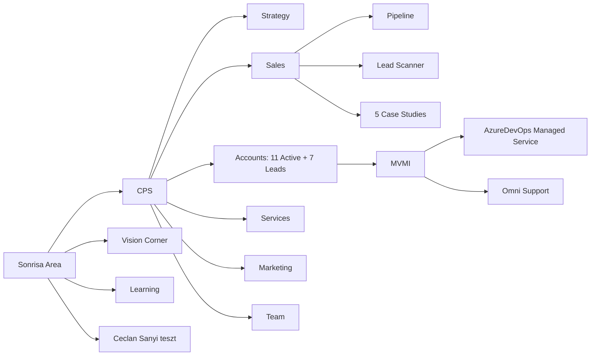

# Sonrisa — Knowledge Map

Domain-level map of the Sonrisa Area. Groups files by topic, surfaces cross-references between sub-units.

## 1. CPS (Cloud Platform Services) — Business Unit

### 1.1 Identity & Strategy
- `CPS/CPS Constitution.md` — vision ("Backstage Crew who runs the show"), mission (Stability / Innovation / Growth), 6 values (Alázat as #1)
- `CPS/Strategy/Roadmap.md` — Horizon 1/2/3 (months 1-3 / 4-6 / 7-12)
- `CPS/Strategy/BMC v1.3.md` — Business Model Canvas
- `CPS/Strategy/CPS Sales Strategy v2.0.md` — 3-engine model, 90-day plan
- `CPS/Strategy/AWS/AWS Partnership.md`, `AWS Seller Prime Strategy Document.md` — AWS partnership track
- `CPS/Strategy/Oracle tudás.md`, `CPS/Partnership/Oracle/Oracle Partnership.md` — Oracle track
- `CPS/Strategy/Managed service/` — managed-service strategy notes
- `CPS/Strategy/FinOps/TODO.md` — FinOps stub
- `CPS/Strategy/Competitor Reports/` — weekly competitor scans (automated Mondays)
- `CPS/Strategy/24_7 support.md` — 24/7 on-call notes

### 1.2 Sales Engine
- `CPS/Sales/SALES_ENGINE.md` — agentic flow doc
- `CPS/Sales/Pipeline.md` — Kanban board
- `CPS/Sales/Dashboard.md` — KPI dashboard
- `CPS/Sales/Sales Enablement/` — discovery script, qualification checklist, objection handling, outreach sequences, lead notes
- `CPS/Sales/Sales Enablement/Lead Scanner/` — `SCANNER_SCRIPT.md` + daily briefs + 3 dossiers + `seen-companies.md`
- `CPS/Sales/Case Studies/` — `INDEX.md`, `TEMPLATE.md`, 5 client case studies (`cs-001` … `cs-005`), generator prompt
- `CPS/brainstorm/brainstorm_sales-strategy-agentic-review.md` — thinking team review

### 1.3 Accounts (Clients)
**Active (11):** Colosseum_Dental, Diligentes, Direct_Travel, Green_Hill_SynLab, Jumeon, MelindaSteel, MVMI (with sub-engagements: AzureDevOps Managed Service, Omni Support), OKFO, Observer, Onriva, ProSharp, SocialBud — each has `NOTES.md`.
**Leads (7):** Allonic, CIG_Pannonia, EOS_Faktor, Greenergy, KBOSS_Szamlazz, NETOPIA_Payments, SafeFleet_Telematics — each has `NOTES.md`.
**Template:** `CPS/Accounts/_Template/NOTES.md`

Cross-references:
- Colosseum_Dental contract review → `Accounts/Active/Colosseum_Dental/email_*` + project state risk #1
- MVMI AzureDevOps contract review → `szerzodes_notes.md` + `01_PROJECT_STATE.md` risk #3
- MelindaSteel n8n project → 2 brainstorm files + 4 technical docs (v1.0, v4 pitch, action plans)
- Case studies map to clients: cs-001 MVMI, cs-002 Observer, cs-003 Onriva, cs-004 MVMI Azure DevOps, cs-005 OKFO

### 1.4 Services
- `CPS/Services/Managed Cloud Platform Services (CPS).md` — flagship offering
- `CPS/Services/AWS *.md` — AWS service variants (CI/CD, Architecture, Cost Optimization, DevOps)
- `CPS/Services/Azure DevOps Platform Services.md`
- `CPS/Services/Cloud Migration Services.md`
- `CPS/Services/Cost optimization/` — full toolkit: `Service Description`, `TASKS.md`, `CLAUDE.md`, competitor analysis, executive report skeleton+generator, sample raw report, validation prompt, glossary
- `CPS/Services/ITIL/` — `itil-0_merged.md`, `Eszköz-összehasonlítás_Projektmenedzsment-SLA.md`
- `CPS/Services/Inference Farm/` — LLMaaS: `Description.md`, `LLMaaS — ACE Opportunity Summary.md`, `Open Source Models(-Extended).md`

### 1.5 Marketing
- `CPS/Marketing/CPS - Introduction - Short.md`
- `CPS/Marketing/Sonrisa general description.md` (duplicate of root file — see GAPS)
- `CPS/Marketing/Blogs/` — 3 Managed Service blog series (each: raw-outline, article v0.1+v0.2(+v0.3+v0.4), LinkedIn_v1) + `COMPETITIVE-BRIEF-2026-03-25.md` + `Ideas/Plan.md` (4 idea drafts)
- `CPS/Marketing/website/` — `CLAUDE.md`, `article-patterns-reference.md`, two landing page structures (Azure DevOps, LLMaaS), `sellvio-cms-component-guide.md`

### 1.6 Team & Operations
- `CPS/Team/01. Team.md` — team roster
- `CPS/Team/Workshop.md` + `Workshop Summary 2026-03-24.md`
- `CPS/Team/Recruitment/` — 2 candidates (Csirak Raymond, Kulcsár Vencél), both halted per workshop decision
- `CPS/Team/Units/00_Units_Concept.md` + `Units/Communication/` (7 files: 00_Index, 01_Bevezeto, 02_A_Jovo, 03_Kliens_Tapasztalat, 04_Eszkalacios_Keretrendszer, 05_Idologgolas, 06_Szerepek_Felelossegek, 07_TODO_Hianyzo_Fejezetek)
- `CPS/Administration/` — `CPS Monthly Process` v0.1 + un-versioned, MUB monthly process docs (2026_02/03/04 + example), MUB Instructions v0.1 + v0.2
- `CPS/TASKS.md` — detailed task tracker
- `CPS/PO_numbers.md` — purchase order reference

### 1.7 Memory (AI persistent KB)
`CPS/memory/`: `certifications.md`, `dashboard-update-process.md`, `packages.md`, `processes.md`, `recruitment.md`, `sharepoint-sync-issue.md`, `statistics-process.md`, `team.md`, `values.md`

### 1.8 Partnerships
- `CPS/Partnership/AWS/` — `Ingram Micro.md`, `certifications.md`
- `CPS/Partnership/Oracle/Oracle Partnership.md`

## 2. Vision Corner — Internal Podcast

- `Vision Corner/CLAUDE.md` — show metadata, key people, episode table
- `Vision Corner/Vision Corner General Description.md` — original problem statement + format design
- `Vision Corner/Vision Corner - Episodes prompt.md` — prompt scaffolding
- `Vision Corner/EP 7-8.md`, `EP 9-10.md`, `EP 11-EP12.md` — episode planning files (paired guests)
- `Vision Corner/TASKS.md`, `TODO.md` — task tracking
- `Vision Corner/runbook-video-release.md` — release runbook

## 3. Learning

- `Learning/AI Roadshow - Vibe coding.md` — stub with discussion questions

## 4. Ceclan Sanyi teszt

- `dashboard.html` only (no markdown). Test/experimental workspace.

## Cross-Unit Connections

- `Sonrisa General Description.md` (root) ↔ `CPS/Marketing/Sonrisa general description.md` — content overlap, distinct files
- CPS Constitution values ↔ `CPS/memory/values.md` ↔ recruitment red-flag criteria in `CPS/CLAUDE.md`
- CPS Sales Engine ↔ Pipeline ↔ Dashboard ↔ Lead Scanner — tight loop, all reference each other
- Workshop Summary 2026-03-24 ↔ Unit Model docs ↔ TAM-related project-state actions
- Vision Corner ↔ Sonrisa company-level (separate concern from CPS, but same parent org)

## Optional Mermaid Sketch

---
*Generated by Vault Librarian v0.3 (index mode, read-only).*
