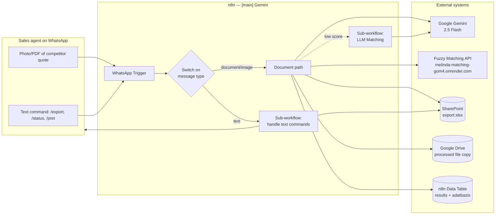
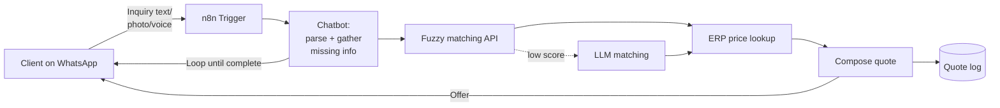

# Melinda n8n Automation — Project Documentation

*A guide for newcomers joining the project. Covers the existing (legacy) competitor-price automation and the requirements for the next iteration: a client-facing quoting automation.*

---

## 1. Background & Business Context

Melinda Steel is a steel-products distributor operating in Romania. Sales agents
regularly receive quote documents (PDFs, images, occasionally handwritten) from
**competitor suppliers** — they list steel products (pipes, profiles, sheets),
prices, units, payment terms, and the issuing company and its client. To stay
competitive, Melinda needs a consolidated, up-to-date view of what competitors
charge for comparable products across the market.

The legacy automation — an **n8n** workflow named `[main] Gemini` — industrialises
this process: a sales agent takes a photo of (or forwards) a competitor quote into
a dedicated WhatsApp number, and the workflow parses the document, matches the
line items against Melinda's own product catalogue, computes a normalised
price-per-ton in EUR, appends a row per item to a master Excel file on SharePoint,
and reports back on WhatsApp.

The next iteration — which this document also scopes — flips the direction of the
pipeline: **clients** message a Melinda-operated WhatsApp number asking for a
quote, and the workflow answers with Melinda's current prices, using the ERP
system as the price source and a conversational flow to fill in missing
information.

---

## 2. High-Level Architecture (Legacy)



At a glance: one main workflow, two called sub-workflows, three external services
(Gemini, the fuzzy-matching API, and Microsoft Graph for SharePoint), plus the
WhatsApp Cloud API for both input and output.

---

## 3. Legacy Workflow — Logical Components

The main workflow is visually organised in n8n with Hungarian section labels
(sticky notes). This document uses the same divisions so the written
documentation lines up with what a newcomer sees on the canvas.

| Hungarian label | Meaning | Purpose |
|---|---|---|
| **Bemenet** | Input | Receive and classify inbound WhatsApp events |
| **Kiolvasás** | Extraction | Download the document and extract structured line items with Gemini |
| **Matchelés** | Matching | Match each extracted item against Melinda's product catalogue |
| **Számolás** | Calculation | Normalise prices to EUR per ton |
| **Visszakérdezés** | Asking back | Ask the agent for missing supplier/client info |
| **Kimenet** | Output | Append rows to SharePoint, confirm via WhatsApp |

### 3.1 Input (Bemenet)

Two entry points feed the pipeline.

**WhatsApp Trigger (primary).** Listens to the Melinda WhatsApp Business number
(phoneNumberId `798670010004469`) via the WhatsApp Cloud API. Each inbound event
is routed by the **Switch** node on `messages[0].type`:

- `document` → document extraction path
- `image` → document extraction path (same branch)
- `text` → calls the `[subworkflow] handle text commands` sub-workflow

**Webhook.** A separate HTTPS webhook at path
`6e7482b2-8b88-49d2-8b45-7145abaa65c1/webhook` exists solely to answer Meta's
WhatsApp verification handshake: it echoes back `hub.challenge` via the
`Respond to Webhook` node. This is required to register the phone number with the
WhatsApp Cloud API and is not part of normal operation.

There are also a **Manual Test** trigger and an **Evaluation trigger / dataset
path** used while developing or regression-testing the pipeline against a stored
dataset; they are not used in production.

### 3.2 Extraction (Kiolvasás)

Once the Switch routes a document or image, the pipeline does the following:

1. `Fetching Download URL` — calls the WhatsApp Cloud API `media/mediaUrlGet`
   operation to resolve the signed URL for `messages[0].document.id` or
   `messages[0].image.id`.
2. `Downloading document` — HTTP GET on that URL (with the WhatsApp credential)
   to pull the binary into the workflow.
3. `Save processed file` — archives the file to SharePoint under
   `/AI Projekt-1/01Konkurencia árak/Processed documents/{RequestId}.{pdf|jpg}`
   (site ID `melindasteelro.sharepoint.com`, drive ID
   `a9b3f830-6cad-4dd9-8c50-738418ec9950`). This gives an audit trail of every
   processed file.
4. `Analyze document` — Google Gemini `models/gemini-2.5-flash`, `document`
   resource. The prompt asks Gemini to extract a JSON array of items with the
   keys:

   ```
   Denumire, Denumire_enriched, Pret, UM, Furnizor, Client, Date,
   Currency, Quantity, CUI_furnizor, CUI_client, Termen_de_plata
   ```

   `Denumire_enriched` is a normalised product name Gemini is asked to derive
   from contextual text in the document (material grade, standard, profile
   shape). There are detailed in-prompt rules, for example reordering the
   dimensions of rectangular pipes to a descending order
   (`20x30x1.5 → 30x20x1.5`) and composing canonical strings like
   `Teava_sudata_longitudinal_rect_30x20x1.5/S235JRH_EN10219-1,2`. The quality of
   the downstream matching depends on this enrichment.

5. `Code in JavaScript` — strips the ```` ```json ... ``` ```` markdown fences
   Gemini sometimes wraps the output in and parses it to an object.
6. `Filter out items missing Price` — drops rows where `Pret` is null/undefined,
   because they cannot be matched or priced meaningfully.

### 3.3 Asking back (Visszakérdezés)

Competitor quotes regularly omit either the issuing supplier (`Furnizor`) or the
client (`Client`), so there is an interactive fallback:

- `If Furnizor and Client is present` — checks the first item's `Furnizor` and
  `Client`.
- If either is missing, `Ask about furnizor and client` sends a WhatsApp
  interactive `sendAndWait` message with a dropdown listing the known suppliers
  (`Trutzi, Mitliv, Prosider, Baurom, Damila, Olimp Impex, Intertranscom,
  Moldmetal, Miras, Baduc`) and a free-text field for client. The workflow pauses
  up to 30 minutes for the agent's reply.
- `Merge user answers` overwrites every item's `Furnizor`/`Client` with the
  values the agent supplied, then the flow continues as if the document had been
  complete.
- If the two fields were present, a `Combine` merge still runs to harmonise
  shapes, and the flow proceeds.

### 3.4 Matching (Matchelés)

Matching the extracted line items to Melinda's own product catalogue happens in
two tiers.

**Tier 1 — algorithmic fuzzy matching.** `Calling matching API` POSTs the items
array to `https://melinda-matching-gom4.onrender.com/match`. This is an external
Python service (hosted on Render) that performs fuzzy matching against Melinda's
catalogue and returns each item enriched with a best-match `match`, `score`,
`ITEMKEY`, `WEIGHT`, and related fields. (Its source lives outside of n8n — treat
it as a black box when extending the workflow.) The
`[subworkflow] handle text commands` has a `/status` command that pings the
service's `/health` endpoint for operational visibility.

`Standardizing furnizor` normalises the `furnizor` string against the same
10-name allow-list used in the dropdown above; if no known supplier name is
found as a substring, it falls back to `null`.

**Tier 2 — LLM matching fallback.** `If matching score low` checks `score < 60`
(hard-coded threshold). Items below the cutoff are sent to
`[subworkflow] LLM Matching`. See §3.7.

The downstream `If not all this way` / `If not all this way1` branches compare
`$input.all().length` to the number of items originally sent to the matching API
— they detect items that silently dropped out of matching so the Calculation
stage only runs on a consistent set.

### 3.5 Calculation (Számolás)

`Calculating eurperton` is a small JS node that produces the single
business-critical metric used to compare competitor prices:

```
eurperton = round( (ronpermeter * 1000 / WEIGHT) / 5.1 )
```

- `ronpermeter` comes from the matching API (or LLM subworkflow) as the
  normalised RON price per linear meter.
- `WEIGHT` is kg/UM (usually kg/m), resolved from Melinda's catalogue via
  `ITEMKEY`.
- `5.1` is a **hard-coded RON → EUR divisor**. It does not update automatically;
  treat this as a known tech-debt item when prices or FX move materially.

### 3.6 Output (Kimenet)

Two storage writes and one notification happen at the end of the run.

1. `Get RequestId list` + `Find the next RequestId` — reads the `RequestID`
   column of the SharePoint Excel table `Main` and computes
   `nextId = max(existing) + 1`. `RequestId` is the **cross-system correlation
   key** — every row of a given document shares it, and the archived PDF/JPG in
   SharePoint is named `{nextId}.{ext}`.
2. `Add Row to Excel1` — a POST to
   `.../drive/root:/export.xlsx:/workbook/tables/Main/rows` adds one row per
   extracted item to the master SharePoint workbook. The column order is
   hard-coded in the JSON body; any schema change to the Excel table must be
   mirrored here.
3. `Insert row` + `Get row(s)1` — mirrors the same data into an n8n **Data
   Table** called `results` (id `EMAoLBqT4usWFf6f`) so subsequent runs and the
   text-command sub-workflow can query without round-tripping through Microsoft
   Graph.
4. `Convert to File` + `Update file` — writes a snapshot of the data table to
   Google Drive and `Save to sharepoint` PUTs the same file back to SharePoint
   (`export.xlsx`). The two destinations are belt-and-braces mirroring; Google
   Drive has historically been the quicker target for manual inspection.
5. `Sending success message` — WhatsApp reply to the originating agent:
   ```
   Succes
   Furnizor: <name>
   Client: <name>
   RequestId: <id>
   ```

### 3.7 Sub-workflow — `[subworkflow] LLM Matching`

Called when tier-1 fuzzy matching produces a score below 60.

```mermaid
flowchart LR
    T[executeWorkflowTrigger] --> GR[Get row(s) from<br/>n8n DataTable 'adatbazis']
    GR --> AGG[Aggregate to one item]
    T --> M[Merge combineAll]
    AGG --> M
    M --> L[Loop Over Items<br/>batch size 1]
    L --> CHAIN[Chain LLM:<br/>Match offers with products]
    CHAIN --> W[Wait 7 min]
    W --> L
    L --> AGG2[Aggregate 'output'] --> SO[Split Out]
```

Key points:

- The entire Melinda product catalogue is stored in the n8n data table
  `adatbazis` (id `964F4vSJjW9njWhY`) and merged into every call so Gemini can
  pick from it.
- `Match offers with products` is a LangChain `chainLlm` using Gemini (with an
  OpenAI `chatgpt-4o-latest` model connected but not wired as the default). The
  prompt instructs Gemini to fill in `ITEMKEY`, `WEIGHT`, `CATEGORIE_ARTICOL`,
  `FOREIGNNAME`, and `GRUPA` for the supplied product name, and to preserve
  `null` values rather than convert them to empty strings.
- `Structure Output` is a LangChain structured output parser (with `autoFix`)
  constrained by a JSON example with all the downstream fields (see the node's
  parameters for the canonical shape).
- Batching is `batchSize: 1` with `delayBetweenBatches: 60000` ms, followed by
  an additional 7-minute `Wait` between batches — this is a **Gemini
  rate-limiting safeguard**. It means LLM-matching a 20-item document can take
  more than 2 hours. This is the single biggest performance constraint in the
  pipeline today.

### 3.8 Sub-workflow — `[subworkflow] handle text commands`

Called when the WhatsApp message is text rather than a document. Implements
operator-facing commands:

| Command | Effect |
|---|---|
| `/export` | Reads the full `Main` table from `export.xlsx`, converts the range into an XLSX file, and sends it back as a WhatsApp document. |
| `/status` | GETs `https://melinda-matching-gom4.onrender.com/health`. Replies `OK` if the matching service is up. |
| `/pret` | Finds the latest `RequestId` sent by the caller (matched by `AgentPhoneNumber`), returns both the structured text (`Furnizor`, `Client`, `RequestId`, then each `MelindaProductName` with its `Price_eur_per_ton`) and an XLSX attachment. |

Access control is enforced by the `Access control` If node: a hard-coded
whitelist of phone numbers (`40721339450`, `40726703127`, `40749257751`,
`40742146912`, …). Non-whitelisted numbers receive an "Unauthorized" reply and
the workflow stops with `Stop and Error`.

---

## 4. Data Model

### 4.1 Master SharePoint Excel — `export.xlsx`, table `Main`

One row per extracted item. The column order is hard-coded in
`Add Row to Excel1` as a positional `values` array; any schema change must be
applied in three places in lockstep: the SharePoint workbook, the
`Add Row to Excel1` body, and the n8n data table mirror.

Known columns (in the order written by `Add Row to Excel1`):

```
RequestId, Furnizor, CUI_furnizor, Client, CUI_client,
CompetitorProductName (original), MelindaProductName (match),
Price_eur_per_ton (eurperton), Quantity, OfferPrice, UM, Currency,
ProductWeight_kg_per_UM (WEIGHT), WeekNumber (derived), Date,
Termen_de_plata, ...
```

The n8n data table `results` (id `EMAoLBqT4usWFf6f`) mirrors the same shape,
with additional bookkeeping fields (`AgentPhoneNumber`, `ExecutionId`,
`ITEMKEY`, `FOREIGNNAME`, `CATEGORIE_ARTICOL`, `GRUPA`).

### 4.2 Product catalogue — n8n data table `adatbazis` (id `964F4vSJjW9njWhY`)

Source of truth for the LLM-matching fallback. Each row is a Melinda product
with its `ITEMKEY`, canonical name, weight, category, foreign-language name, and
group. The fuzzy-matching API keeps its own (presumably synced) copy of the same
data.

### 4.3 Archived competitor documents

Every processed file is stored in SharePoint at
`/AI Projekt-1/01Konkurencia árak/Processed documents/{RequestId}.{pdf|jpg}`.
`RequestId` is the join key between the master table, the WhatsApp
acknowledgement, and the archived original.

---

## 5. External Integrations

| System | Used for | Credential / Auth |
|---|---|---|
| WhatsApp Cloud API | Inbound trigger, media download, replies, interactive forms | WhatsApp App credential; phone number ID `798670010004469` |
| Google Gemini (`gemini-2.5-flash`) | Document extraction and fallback matching | Google API credential |
| OpenAI `chatgpt-4o-latest` | Connected to the LLM Matching subworkflow but not the primary model | OpenAI API credential |
| Matching API (Render) | `POST /match` fuzzy matching, `GET /health` liveness | None (public endpoint) |
| Microsoft Graph / SharePoint | `export.xlsx` read/write, processed-file archive | Generic OAuth2 credential |
| Google Drive | Mirror of `export.xlsx` for quick inspection | Google Drive OAuth2 |
| n8n Data Tables | `results` (id `EMAoLBqT4usWFf6f`), `adatbazis` (id `964F4vSJjW9njWhY`) | n8n-internal |

---

## 6. Known Gaps & Tech Debt in the Legacy

These are the things a newcomer should keep in mind when making changes; they
are not blockers for normal operation but each is a sharp edge.

- **Hard-coded RON → EUR rate (5.1).** The `Calculating eurperton` node divides
  by a fixed constant. If FX moves, historical `Price_eur_per_ton` rows become
  incomparable with new ones.
- **Hard-coded match-score threshold (60).** The tier-1 → tier-2 handoff is not
  tunable without editing the workflow.
- **Hard-coded supplier allow-list.** The dropdown in
  `Ask about furnizor and client` and the allow-list in `Standardizing furnizor`
  must be edited together when onboarding a new competitor.
- **Hard-coded operator phone allow-list** in `handle text commands →
  Access control`. Adding a new sales agent requires editing the workflow.
- **Rate-limiting in the LLM matching loop** (`batchSize: 1`, 1-min+7-min waits
  per batch). Designed to stay under Gemini quotas, but means big documents can
  take hours.
- **Schema changes to the master Excel** require coordinated edits to
  `Add Row to Excel1`, the workbook table definition, and the `results` data
  table.
- **Column order is positional**, not keyed, in `Add Row to Excel1`. Reordering
  the Excel table will silently corrupt historical data.
- **Two copies of `If not all this way`** (one after the LLM subworkflow, one
  after the score check) with identical logic — a candidate for consolidation
  into a single sub-chain.
- **No automated retries or DLQ** on the matching API call; a transient Render
  outage fails the whole run silently.

---

## 7. New Project — Client Quoting Automation

### 7.1 Goal

Let a **client** send a quote inquiry to a Melinda WhatsApp number in natural
language ("price for 500m of 50x30x2 rectangular tube?") and receive a
Melinda-priced offer back, typically within one conversation.

### 7.2 User journey (target)



### 7.3 What is reusable from the legacy

- **Matching, both tiers.** The `melinda-matching-gom4.onrender.com/match`
  service and the `[subworkflow] LLM Matching` flow are directly reusable once
  the client's request is normalised into the same item shape (at minimum
  `Denumire_enriched`, `UM`, `Quantity`).
- **`Denumire_enriched` normalisation rules** from the Gemini prompt in
  `Analyze document`. These rules are the canonical form the matching API
  expects; reuse them verbatim when parsing client messages.
- **Supplier / customer allow-lists and phone-whitelist patterns** (with the
  caveat that the client-facing workflow needs an *inverted* access model — open
  to unknown clients by default, with abuse controls).
- **WhatsApp Cloud API integration** (trigger, media URL fetch, send, interactive
  forms, document attachments).
- **Archival + correlation-ID pattern** (`RequestId` + SharePoint-stored original).

### 7.4 What is genuinely new

1. **Free-form message parsing.** Legacy inputs are structured PDFs; client
   inquiries will be short, informal, and often partial ("do you have 6m tube
   30x30x2 S235?"). The extraction prompt from `Analyze document` will need to
   be redesigned around conversational input rather than tabular documents.
2. **Conversational back-and-forth.** The legacy "ask back" pattern uses a
   single interactive form (`sendAndWait` with a dropdown). Clients will
   typically need multi-turn clarification: quantity, delivery address, required
   standard/material, delivery timeline, payment terms. This calls for a
   state-holding chatbot (LangChain agent or an explicit FSM in n8n) rather
   than a single form.
3. **ERP integration for live prices.** The legacy flow doesn't need current
   Melinda prices — it only records competitors. The new flow must authenticate
   into Melinda's ERP, look up current pricing per `ITEMKEY`, apply
   client-specific discount rules, and include stock/lead-time information.
   This is the largest single piece of new integration work.
4. **Quote composition and formatting.** The output is a priced offer addressed
   to a (possibly new) client, not a row in an internal spreadsheet. That
   requires a template, terms & conditions, and a stable quote numbering scheme
   that is distinct from `RequestId`.
5. **Identity and access model.** Inbound senders are unknown clients, not a
   small fixed list of agents. The system needs client onboarding (name, CUI,
   contact), anti-abuse rate-limits, and likely a handoff-to-agent path for
   anything the bot can't confidently price.

### 7.5 Future iterations (per project scope)

- **Email channel.** Same pipeline triggered by an IMAP/Graph mail watcher,
  replying on the same thread.
- **Handwriting.** OCR on scanned handwritten inquiries — feasible as a
  preprocessor on top of Gemini's vision capability, but worth benchmarking.
- **Voice notes.** Transcription (Whisper or Gemini) → same parsing chain.

### 7.6 Open questions for the team

These are things the specification should pin down before implementation
starts; flagging them here so newcomers know they are open.

- **Which ERP system** and which access method (direct DB, REST, SOAP, export
  feed)? This gates the entire pricing stage.
- **Client identity vs. phone number.** Is a phone number sufficient, or does
  the bot need to resolve it to a known CUI (tax ID) in Melinda's CRM before
  quoting?
- **Discount policy.** Who authorises deviation from list price? Does the bot
  apply a rule set, or route anything non-standard to a human?
- **Rate-limiting of LLM matching.** The legacy 7-minute `Wait` will not fly in
  a client-facing conversation. Can we negotiate a higher Gemini quota, cache
  common matches, or only run tier-2 matching asynchronously and reply
  "calculating…"?
- **Quote numbering.** Likely distinct from `RequestId`; needs to align with
  however the ERP already numbers offers.
- **Languages.** The legacy prompts and dropdowns mix Romanian and Hungarian.
  The client-facing bot will need a language-detection step and translated
  replies.
- **Persistence of conversational state.** n8n is fundamentally
  execution-scoped. Multi-turn chat state will need an external store (Redis,
  a dedicated data table, or a LangChain memory backing) keyed by WhatsApp
  `from`.

---

## 8. Glossary

- **WhatsApp Cloud API** — Meta's hosted WhatsApp Business API. The workflow
  uses it for triggers, media fetch, message send, and interactive forms.
- **Fuzzy matching API** — Custom Python service at
  `melinda-matching-gom4.onrender.com`, treated as a black box by n8n.
- **LLM matching** — Gemini-based fallback matcher invoked when the fuzzy match
  score is below 60.
- **ITEMKEY** — Melinda's internal product identifier (primary key in the
  catalogue).
- **Denumire / Denumire_enriched** — Romanian for "name" / "enriched name"; the
  raw and normalised forms of a product name.
- **Furnizor / Client / CUI** — Romanian for "supplier" / "client" /
  tax-registration number (used as the stable customer ID in Romania).
- **RequestId** — Integer correlation key per processed document; joins the
  SharePoint row, the archived original, and the WhatsApp acknowledgement.
- **UM** — "Unitate de măsură" (unit of measure); usually `M` (metre) or `KG`.
- **Bemenet / Kiolvasás / Matchelés / Számolás / Visszakérdezés / Kimenet** —
  Hungarian labels on the n8n canvas corresponding to the six logical stages.

---

## 9. Files in this folder

| File | What it is |
|---|---|
| `[main] Gemini (4).json` | The main n8n workflow — the entry point from WhatsApp. |
| `[subworkflow] LLM Matching (1).json` | Tier-2 matching fallback called when fuzzy score < 60. |
| `[subworkflow] handle text commands (1).json` | Operator commands (`/export`, `/status`, `/pret`) for agents on WhatsApp. |
| `PROJECT_DOCUMENTATION.md` | This document. |
