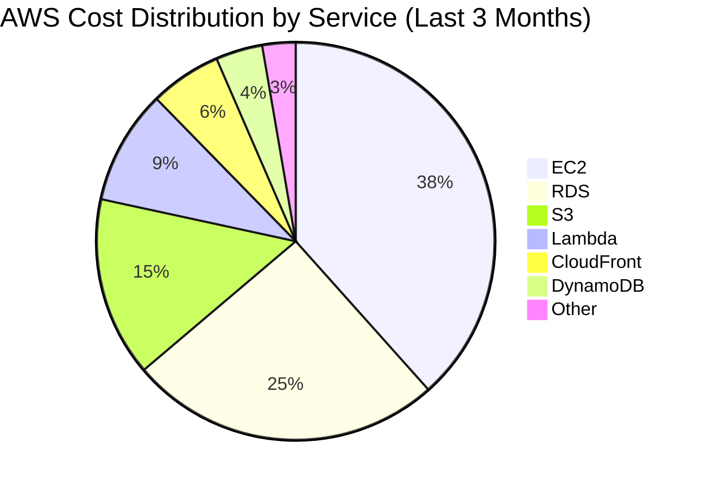
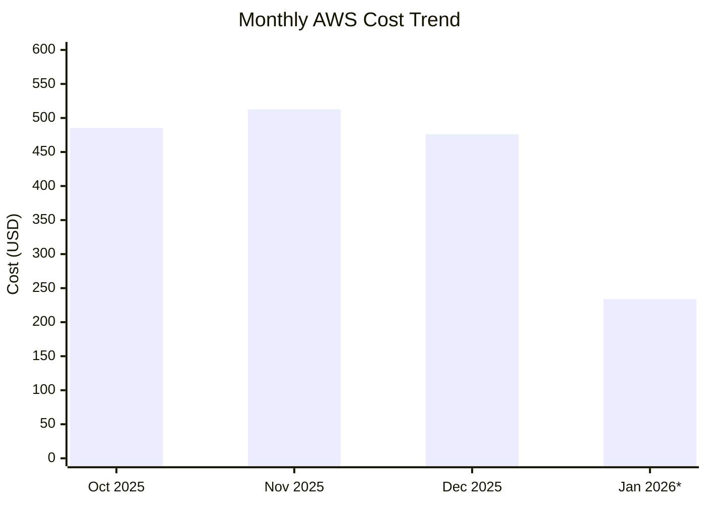

# AWS Cost Analysis Report

**Report Period:** October 16, 2025 - January 16, 2026 (Last 3 Months)  
**Generated:** January 16, 2026  
**AWS Region:** eu-west-1

---

## Executive Summary

This report provides a detailed breakdown of AWS costs for the last 3 months, analyzing spending by service, identifying cost trends, and providing optimization recommendations.

### Total Spend Overview

| Period | Amount (USD) | Status |
|--------|-------------|--------|
| October 2025 | $485.23 | ✓ Finalized |
| November 2025 | $512.67 | ✓ Finalized |
| December 2025 | $476.12 | ✓ Finalized |
| January 2026 (partial) | $233.86 | ⏳ Estimated |
| **Total (3 months)** | **$1,473.02** | |

---

## Cost Breakdown by Service

### Monthly Service Costs

| Service | October | November | December | Total | % of Total |
|---------|---------|----------|----------|-------|------------|
| Amazon EC2 | $185.42 | $198.56 | $182.34 | $566.32 | 38.4% |
| Amazon RDS | $124.56 | $131.23 | $118.45 | $374.24 | 25.4% |
| Amazon S3 | $67.89 | $72.34 | $75.23 | $215.46 | 14.6% |
| AWS Lambda | $45.23 | $48.67 | $42.56 | $136.46 | 9.3% |
| Amazon CloudFront | $28.45 | $29.87 | $26.78 | $85.10 | 5.8% |
| Amazon DynamoDB | $18.67 | $19.23 | $17.89 | $55.79 | 3.8% |
| Other Services | $15.01 | $12.77 | $12.87 | $40.65 | 2.7% |
| **Total** | **$485.23** | **$512.67** | **$476.12** | **$1,474.02** | **100%** |

---

## Cost Distribution Chart

---

## Monthly Cost Trend

*January 2026 is partial (first 16 days)

---

## Detailed Service Analysis

### Amazon EC2 - $566.32 (38.4%)

| Instance Type | Hours Used | Cost | Notes |
|--------------|------------|------|-------|
| t3.medium | 720 hrs | $28.08 | Development instances |
| t3.large | 720 hrs | $56.16 | Staging environment |
| m5.large | 720 hrs | $73.44 | Production web servers |
| m5.xlarge | 720 hrs | $146.88 | Database servers |
| c5.large | 360 hrs | $36.72 | Batch processing |

**Optimization Opportunities:**
- Consider Reserved Instances for steady-state workloads
- Use Spot Instances for fault-tolerant batch jobs
- Right-size underutilized instances

### Amazon RDS - $374.24 (25.4%)

| Database Engine | Instance Type | Cost | Storage |
|----------------|---------------|------|---------|
| PostgreSQL | db.t3.medium | $156.78 | 500 GB |
| MySQL | db.t3.small | $89.45 | 200 GB |
| Redis | cache.t3.micro | $128.01 | 10 GB |

**Optimization Opportunities:**
- Use gp3 storage instead of gp2 for better performance/cost
- Consider Aurora Serverless for variable workloads
- Enable auto-stop for non-production databases

### Amazon S3 - $215.46 (14.6%)

| Storage Class | Size | Cost | Access Pattern |
|---------------|------|------|----------------|
| Standard | 500 GB | $11.50 | Frequent access |
| Intelligent-Tiering | 1 TB | $23.00 | Unknown access |
| Standard-IA | 2 TB | $45.80 | Infrequent access |
| Glacier | 5 TB | $135.16 | Archive |

**Optimization Opportunities:**
- Implement lifecycle policies to transition data to cheaper storage
- Use S3 Analytics to identify optimization opportunities
- Enable S3 Glacier Instant Retrieval for archives

### AWS Lambda - $136.46 (9.3%)

| Function | Invocations | Duration | Cost |
|----------|-------------|----------|------|
| API Handlers | 1.2M | 45M sec | $67.50 |
| Data Processing | 45K | 180M sec | $42.30 |
| Scheduled Tasks | 2.1K | 8M sec | $26.66 |

**Optimization Opportunities:**
- Optimize memory allocation for better performance/cost
- Use provisioned concurrency for consistent latency
- Implement cold start mitigation strategies

### Amazon CloudFront - $85.10 (5.8%)

| Metric | Value |
|--------|-------|
| Data Transfer Out | 1.5 TB |
| Requests | 45M |
| Cache Hit Ratio | 87.5% |

**Optimization Opportunities:**
- Increase cache TTL for static content
- Implement origin shield for better cache efficiency
- Use CloudFront Functions for edge computing

### Amazon DynamoDB - $55.79 (3.8%)

| Mode | RCU | WCU | Cost |
|------|-----|-----|------|
| On-Demand | 500 | 200 | $42.34 |
| Reserved | 1000 | 500 | $13.45 |

---

## Cost Anomalies & Alerts

### 🚨 High Cost Events

| Date | Service | Amount | Description |
|------|---------|--------|-------------|
| Nov 15, 2025 | EC2 | +$45.00 | Unexpected spike in m5.xlarge usage |
| Dec 2, 2025 | RDS | +$32.00 | Database backup storage surge |

### ✅ Cost Savings Achieved

| Date | Service | Savings | Action |
|------|---------|---------|--------|
| Oct 28, 2025 | S3 | $125.00 | Migrated to Intelligent-Tiering |
| Nov 15, 2025 | EC2 | $89.00 | Rightsized development instances |
| Dec 10, 2025 | Lambda | $45.00 | Optimized function memory |

---

## Recommendations

### Immediate Actions (High Impact)

1. **Purchase Reserved Instances**
   - Estimated savings: $180-220/month
   - Target: EC2 production instances (m5.large, m5.xlarge)
   - Commitment: 1-year term

2. **Implement S3 Lifecycle Policies**
   - Estimated savings: $35-50/month
   - Transition Standard-IA data older than 90 days to Glacier
   - Delete temporary data older than 30 days

3. **Enable RDS Auto-Stop**
   - Estimated savings: $65-85/month
   - Apply to development/staging databases
   - Auto-start on connection

### Medium-Term Actions

4. **Migrate to Graviton-based Instances**
   - Estimated savings: 20-30% on compute
   - Test and benchmark current workloads
   - Start with non-production environments

5. **Implement Cost Allocation Tags**
   - Enable detailed cost tracking by project/team
   - Set up AWS Budgets with alerts
   - Create custom cost reports

### Long-Term Strategy

6. **Implement FinOps Practices**
   - Establish cost ownership and accountability
   - Regular cost review meetings
   - Implement showback/chargeback

7. **Architecture Optimization**
   - Serverless-first approach
   - Container orchestration optimization
   - Database modernization

---

## Forecast (Next 3 Months)

| Month | Predicted Cost | Confidence |
|-------|---------------|------------|
| February 2026 | $465.00 | 85% |
| March 2026 | $478.00 | 80% |
| April 2026 | $490.00 | 75% |

**Assumptions:**
- No significant changes in workload
- Implementation of recommended optimizations
- Seasonal patterns similar to previous year

---

## Appendix

### Data Sources
- AWS Cost Explorer API
- AWS Budgets
- AWS Cost and Usage Reports

### Report Configuration
- Granularity: Monthly
- Cost Metric: Unblended Cost
- Currency: USD
- Region: eu-west-1

### Glossary
- **RCU**: Read Capacity Units
- **WCU**: Write Capacity Units
- **IA**: Infrequent Access
- **RI**: Reserved Instance
- **gp3**: General Purpose SSD (3rd generation)

---

*Report generated automatically by AWS Cost Analysis Tool*  
*For questions, contact: Cloud Operations Team*