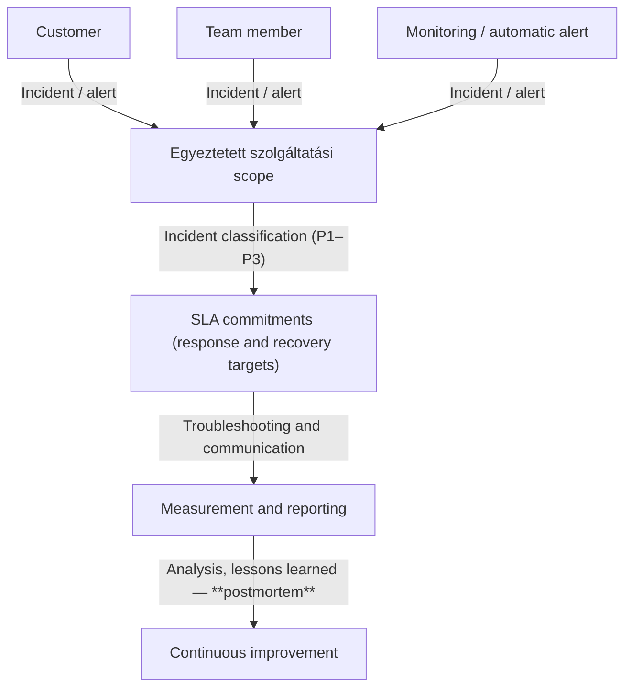

# SLA System --- Internal Unified Version (v1)

*(Merged and aligned from internal drafts)*

------------------------------------------------------------------------

## Why this exists

We want everyone to be aligned on what a **Service Level Agreement
(SLA)** based managed service actually means for us.

This is not an audit document.\
Not a tool specification.\
Not a heavy process manual.

This is our internal baseline covering:

-   what we call an incident\
-   what we promise (and what we don't)\
-   what we measure\
-   where the responsibility boundaries are

Internal clarity first. Everything else builds on that.

------------------------------------------------------------------------

# What "SLA-based service" means for us

If something is under an SLA, we:

-   actively operate it
-   monitor it
-   respond when it degrades or fails\
-   follow predefined response and restoration targets

Typical scope examples:

-   Kubernetes platforms
-   Continuous Integration / Continuous Delivery (CI/CD) environments\
-   Amazon Web Services (AWS) or Microsoft Azure infrastructure\
-   On-premise systems operated by us
-   Monitoring and operational layers

Important: SLA does **not** mean universal ownership of everything
around the system.
Only services that are explicitly agreed, written down, and part of the
defined scope are covered.

------------------------------------------------------------------------

# Expectations 
--- 
What we actually commit to do

We provide:

-   Predictability and trust --- **not guarantees of perfection**
-   Defined response time targets
-   Defined restoration targets
-   Clear ownership boundaries
-   Transparent communication during incidents
-   Awareness of major global infrastructure outages (AWS, Azure, Cloudflare, etc.)

We do **not** promise:
-   zero incidents
-   unlimited responsibility
-   full-stack product ownership unless explicitly agreed

------------------------------------------------------------------------

# What counts as an incident?

An incident is:

> An unplanned interruption or degradation that affects the operation of an agreed managed service

Sources:

-   monitoring alerts
-   client-reported issues
-   internal detection

What is **not** an incident:

-   feature development
-   consulting requests
-   planned changes or deployments
-   performance or cost optimization initiatives
-   custom dashboards, tooling, or automation development

------------------------------------------------------------------------

# Successful operation

Successful operation does **not** mean "nothing ever breaks".

It means:

-   Services run predictably and transparently
-   SLA availability targets are met
-   Incidents are detected and handled according to SLA
-   Response and restoration targets are achieved
-   Clients are informed clearly and on time
-   Recurring issues are analyzed and reduced
-   Reporting is provided (e.g., monthly core metrics)

------------------------------------------------------------------------

## SLA Dimensions (Standard Definitions)

| Term | Definition |
|---|---|
| **Response Time** | Time from ticket creation to first human acknowledgment or action |
| **Resolution Time** | Time from ticket creation to service restoration or permanent fix |
| **Service Hours** | The time window during which SLA clocks run (24×7 or business hours) |
| **Priority** | Derived from Impact × Urgency |

------------------------------------------------------------------------

## Priority Definitions

| Priority | Meaning |
|---|---|
| **P1 — Critical** | Complete service outage or severe business impact |
| **P2 — High** | Major functionality degraded |
| **P3 — Medium** | Partial impact, workaround available |
| **P4 — Low** | Minor issue or service request |

---

## Core SLA Targets

### Essentials
| Priority | Response Time | Resolution Time | Coverage |
|---|---|---|---|
| **P1** | ≤ 4 hrs | ≤ 48 hrs | Business Hours |
| **P2** | ≤ 24 hrs | ≤ 72 hrs | Business Hours |
| **P3** | ≤ 72 hrs | ≤ 3-5 business days | Business Hours |
| **P4** | ≤ 72 hrs | ≤ 5–10 business days | Business Hours |

### Growth
| Priority | Response Time | Resolution Time | Coverage |
|---|---|---|---|
| **P1** | ≤ 2 hrs | ≤ 16 hrs | Extended |
| **P2** | ≤ 8 hrs | ≤ 32 hrs | Extended |
| **P3** | ≤ 48 hrs | ≤ 3 business days | Business Hours |
| **P4** | ≤ 48 hrs | ≤ 5–10 business days | Business Hours |

### Scale
| Priority | Response Time | Resolution Time | Coverage |
|---|---|---|---|
| **P1** | ≤ 1 hr | ≤ 4 hrs | 24×7 |
| **P2** | ≤ 4 hrs | ≤ 8 hrs | 24×7 |
| **P3** | ≤ 24 hrs | ≤ 3 business days | Business Hours |
| **P4** | ≤ 24 hrs | ≤ 5–10 business days | Business Hours |

Alternative Method, use one single SLA table the "Scale", and offer P1-P4, P2-P4, P3-P4 packages.

Resolution times must clearly define whether non-business hours pause
the clock.

------------------------------------------------------------------------

# What we measure

Metrics must be objective and preferably automated.

Core metrics:

-   Uptime / availability
-   Response Time
-   Resolution Time
-   Mean Time Between Failures (MTBF)
-   Mean Time To Repair (MTTR)
-   Incident handling trends
-   Communication consistency

If a metric requires storytelling every month, it's probably not the
right metric.

------------------------------------------------------------------------

# Exceptions

The following are typically excluded from SLA accountability:

-   Third-party provider outages (e.g., cloud provider global failure)
-   Service interruptions during pre-agreed maintenance windows
-   Events outside defined operational scope

------------------------------------------------------------------------

# SLA Breach

Consequences depend on contract terms and may include:

-   Service credits
-   Fee reductions
-   Contractual remedies

------------------------------------------------------------------------

# Responsibilities and boundaries

## Our responsibility:

-   Operating agreed infrastructure components
-   Incident response and troubleshooting
-   Executing controlled operational changes
-   Meeting defined SLA targets

## Client responsibility:

-   Application logic and product decisions
-   Release approvals
-   Business prioritization
-   Systems outside defined SLA scope
-   Timely notification of changes that may impact availability

------------------------------------------------------------------------
## Flow

# Final note

The goal is not to build bureaucracy.

The goal is:

-   predictable operations
-   measurable reliability
-   clear ownership
-   controlled growth

We start simple.
We operate consistently.
We improve continuously.
