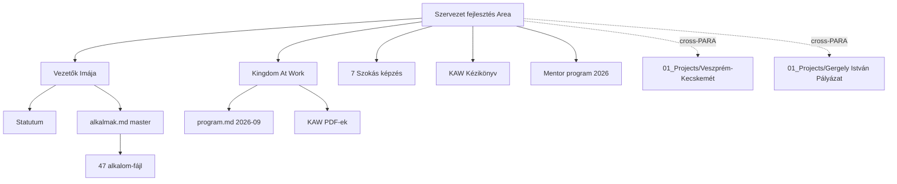

# 00_KNOWLEDGE_MAP — Domain-térkép

## Központi téma

**Keresztény vezetőfejlesztés és közösség-építés** Erdély/Magyarország régióban, Becze Szabolcs (Exar / Ignis) szervezésében.

## Domain-térkép

### A. Közösség / Ima-szolgálat
- **Unit:** `Vezetők Imája/`
- **Központi fájlok:** `Vezetők Imája.md`, `Statutum.md`, `alkalmak.md`
- **Karakter:** havi rendszeresség, 2021 óta, 48+ alkalom
- **Visszatérő szereplők:** Barni Atya, Ábel Tiszti, Bereczki Orbán Zsolt, Mezei Ödön, Ferkő Andor, Hubi Atya, Pitó Zsolt, Örs (zenész)
- **Adatforrások:** Google Sheet (master), Google Drive (#1–#35 mappa), Obsidian (#41–#47 fájl), Canva (kártyák)

### B. Esemény / Konferencia-szervezés
- **Unit:** `Kingdom At Work/`
- **Központi fájlok:** `program.md`, `memory/projects/kingdom-at-work-event.md`
- **Karakter:** egyszeri esemény, 2026-09-25/26 Budapest
- **Külső kapcsolatok:** KAW csapat (Casey, Manfred — Ausztria), Wieslaw, János Atya
- **Workstream-ek:** program, helyszín, fordítás, keynote-ok, table talks

### C. Képzés / Tananyag
- **Fájlok:** `7 Szokás képzés.md`, `KAW - Vezetői Kézikönyv.md`
- **Karakter:** retrospektív (7 szokás, ~150 fő) + jövőbeli (kézikönyv-koncepció)
- **Kulcs kapcsolat:** Fábri Kornál, Fábián Zsolt, Ács Zoli, Lez, Ferenczy Isti?

### D. Mentor program
- **Unit:** `Mentor program 2026/`
- **Fájl:** `Projektek.md` (idea-list)
- **Karakter:** korai stage, ötletek

## Cross-references

| Honnan | Hová | Reláció |
|--------|------|---------|
| `Vezetők Imája/CLAUDE.md` | Google Drive / Sheet | Külső master adatforrás |
| `Vezetők Imája/alkalmak.md` | `01. ... .md` – `47. ... .md` | Master tábla → részfájlok |
| `Vezetők Imája/Hasznos.md` | Google Drive | Egyetlen link |
| `Kingdom At Work/CLAUDE.md` | `memory/projects/kingdom-at-work-event.md` | Kontextus → részlet |
| `Kingdom At Work/program.md` | KAW PDF-ek | Program → forrás |
| `KAW - Vezetői Kézikönyv.md` | `Vezetők Imája` (csoport) | Hivatkozás |
| Cross-PARA | `01_Projects/Szervezet fejlesztés/Veszprém - Kecskemét körút/` | Magyar út, kapcsolódó vezetői körút |
| Cross-PARA | `01_Projects/Szervezet fejlesztés/Gergely István - Pályázat/` | Üzleti terv pdf |

## Mermaid (vázlat)

## Glossary (vault-specifikus)

| Term | Jelentés |
|------|---------|
| Vezetők Imája | Havi keresztény vezetői ima-közösség, 2021 óta |
| Kingdom At Work (KAW) | Budapest konferencia 2026-09 + nemzetközi mozgalom |
| Statutum | A Vezetők Imája alapszabálya |
| Ignis | Becze Szabolcs szervezete (vezetőfejlesztési ág) |
| Exar / ExarLabs | Becze Szabolcs cége |
| Boroinfo, Atalantic, Mikado, Agora Center, OrtoProfil | Visszatérő házigazda-cégek |
