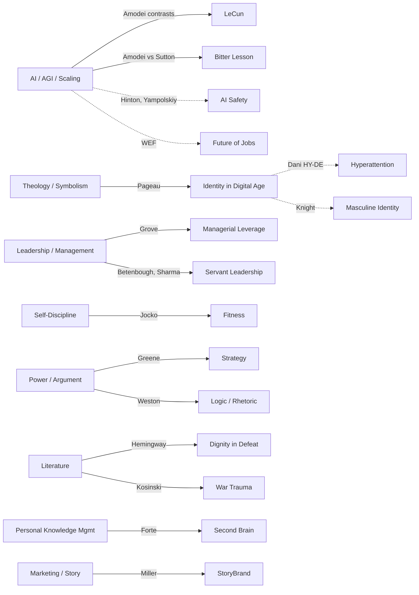

# Knowledge Map — Topics and Themes

Topic clusters across the Resources library, inferred from tags + content. Each cluster lists the primary resources and notable cross-references.

## Cluster 1 — AI, AGI, scaling, and the future

The largest active cluster — dense set of atomic ideas + contrasts around Dario Amodei's "End of the Exponential" thesis, with safety, jobs, and existential risk voices around it.

Primary sources:
- `03_Podcasts/Dwarkesh_DarioAmodei_EndOfExponential_2026-02-13.md` (Dario Amodei, 2026)
- `03_Podcasts/Steven Bartlett - Godfather of AI - Geoffrey Hinton/...` (Hinton)
- `03_Podcasts/Steven Bartlett - The Only 5 Jobs That Will Remain In 2030 - Roman Yampolskiy/...` (Yampolskiy)
- `04_Articles/Summaries/WEF_Future_of_Jobs_Report_2025.md`
- `02_Books/Lee Boonstra - Prompt Engineering/Prompt_Engineering_Lee_Boonstra_2024.md`

Atomic ideas:
- `02_Books/Atomic_Ideas/End_of_the_Exponential.md`
- `02_Books/Atomic_Ideas/Big_Blob_of_Compute_Hypothesis.md`
- `02_Books/Atomic_Ideas/Capability_vs_Product_Gap.md`

Contrasts:
- `02_Books/Contrasts/Amodei_vs_Sutton_on_Learning_Algorithms.md`
- `02_Books/Contrasts/Amodei_vs_LeCun_on_Scaling.md`

Sub-topics: scaling laws, compute, AGI timelines, AI safety / control problem, AI regulation, AI and jobs, AI and cybersecurity, prompt engineering.

## Cluster 2 — Theology, symbolism, identity in the digital age

Pageau-centered cluster spanning books, podcasts, articles.

Primary sources:
- `02_Books/Matthieu Pageau - The Language of Creation/...` (3 depth variants)
- `02_Books/Újvári András - Az isteni axióma/Jegyzetek - Szabolcs.md`
- `03_Podcasts/Jordan Peterson - Philosophy of Human Identity in a Digital Age/...`
- `04_Articles/ARC - Jonathan Pageau - Jordan Peterson/Summary.md` + `brainstorm_pageau_subsidiarity.md`
- `04_Articles/Erzsebet Dani - The HY-DE Model/...` (attention, digital age, identity)

Sub-topics: cosmic symbolism, Genesis, hyperattention, subsidiarity, intermediary structures, digital-age identity, meaning crisis.

## Cluster 3 — Leadership and management

Primary sources:
- `02_Books/Andy Grove - High Output Management/...`
- `02_Books/Betenbough Companies - A Betenbough Modszer Vezetoi kezikonyv/summary.md` (Christian corporate leadership)
- `02_Books/Robin Sharma - The Leader Who Had No Title/...`

Sub-topics: managerial leverage, output of a manager, servant leadership, coaching, corporate culture.

## Cluster 4 — Self-discipline, fitness, masculine identity

Primary sources:
- `02_Books/Jocko Willink - Discipline Equals Freedom/Discipline_Equals_Freedom_Jocko_Willink_2020.md` (+ workouts/)
- `02_Books/Robert Lewis - Raising a Modern-Day Knight/...` (6 atomic ideas on manhood)

Cross-link: Knight's `Masculine_Identity_Crisis.md` connects with Cluster 2 (digital-age identity).

## Cluster 5 — Power, persuasion, argument

Primary sources:
- `02_Books/Robert Greene - The 48 Laws of Power/...`
- `02_Books/Anthony Weston - A Rulebook for Arguments/...` (9 atomic ideas)

Contrasts:
- `Rulebook_vs_Thank_You_for_Arguing.md`
- `Rulebook_vs_Rhetoric.md`
- `Raising_a_Modern_Day_Knight_vs_The_48_Laws_of_Power.md`

Sub-topics: rhetoric, logic, deductive/inductive reasoning, strategy, history of power.

## Cluster 6 — Marketing, storytelling, communication

Primary source:
- `02_Books/Building a Story Brand/Building_a_StoryBrand_Donald_Miller_2017.md` (duplicated at root + Summaries/)

Sub-topics: narrative branding, customer-as-hero, clarity.

## Cluster 7 — Knowledge management, productivity

Primary source:
- `02_Books/Tiago Forte - Building a Second Brain/Building_a_Second_Brain_Tiago_Forte_2022.md`

Tangential: this entire vault is a meta-application of these principles.

## Cluster 8 — Literature

Primary sources:
- `02_Books/Ernest Hemingway - The Old Man and the Sea/...` (4 atomic ideas, 2 contrasts)
- `02_Books/Jerzy Kosinski - A festett madár/...`

Contrasts:
- `The_Old_Man_and_the_Sea_vs_A_Farewell_to_Arms.md`
- `The_Old_Man_and_the_Sea_vs_Moby_Dick.md`

Sub-topics: war trauma, holocaust survival, human condition, dignity in defeat, mentorship.

## Cross-references (notable)

- `Dignity_in_Defeat` appears in two places: `Ernest Hemingway/.../Atomic_Ideas/` AND `Anthony Weston/.../Atomic_Ideas/` — same concept name, two source-books. Potentially duplicated (see GAPS).
- `Raising_a_Modern_Day_Knight_vs_The_48_Laws_of_Power.md` bridges Cluster 4 and Cluster 5.
- Three Atomic Ideas under `02_Books/Atomic_Ideas/` (End_of_the_Exponential, Big_Blob_of_Compute_Hypothesis, Capability_vs_Product_Gap) were generated from a podcast (Amodei) — structurally they should arguably live under `03_Podcasts/Atomic_Ideas/`. See GAPS.

## Optional Mermaid map

