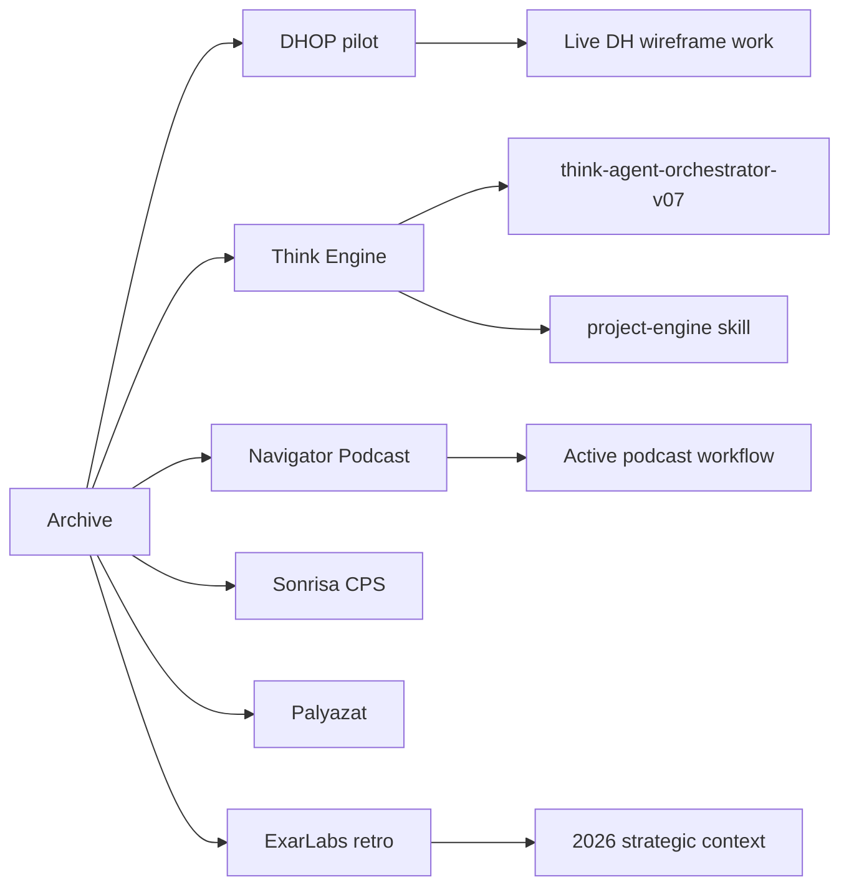

# Archive Knowledge Map

Mit fed le ez az archívum, milyen témákról szól, és melyik élő kontextushoz kapcsolódik (precedens-érték).

## Domain-térkép

### 1. DHOP — Deák Húsmíves Online Platform (pilot előkészítés)
**Original context:** 2026-03-05 — 2026-03-28 időszak. Az Exar Labs első co-venture pilotjának teljes dokumentációs láncolata.
**Témák:**
- Business Model Canvas evolúció (v1.0 → v2.0, kritikus review-val)
- MVP specifikáció (v1.2, 7 epic / 37 task)
- Fejlesztési roadmap (v1.1 → v1.2, architektúra-pivot single PWA-ra, role-based tab bar)
- Pilot koncepció (v1.3) — origin, problem validation, exit criteria
**Élő megfelelő:** valószínűleg `02_Areas/Deák Húsüzlet/` aktív szelete (lásd current branch: `claude/musing-cori-3f0e65` és DH wireframe craft conventions memo).
**Precedens-érték:** magas — minden architektúra-döntés (Google OAuth primary, Facebook OAuth optional/post-MVP, PWA single-app architektúra, sávos revenue share) itt rögzítve.

### 2. AI-Human Think Engine — collaboration OS
**Original context:** 2026-03-31. Két fájlos rendszer az Exar Labs / DHOP projektre.
**Témák:**
- Human (intent & reality) ↔ ChatGPT (strategic cognition) ↔ Claude (operational cognition) protokoll
- 01_PROJECT_STATE.md mint kontroll-fájl definíciója (Project Engine v0.2)
- Context Management protokoll (v0.2 újdonság)
- Browser-based link access az interaction loop-ban
**Élő megfelelő:** `general-utils:project-engine` skill (lásd available skills), illetve `00_Prompts/BDOS/agents/`.
**Precedens-érték:** magas — a jelenlegi multi-AI orchestrator skill (think-agent-orchestrator-v07) elődje/inspirációja.

### 3. Navigátor Podcast — Digitális Székelyföld konferencia (2025.10)
**Original context:** Konferencia-előkészítés és post-mortem; 11 fájlból álló batch.
**Témák:**
- Program áttekintés, panel-térkép
- Vendég-jelöltek (Meghívottak, Kikkel kell beszéljek)
- Egyéni vendég-prep dossziek: Palkovics László, Charaf Hassan, Süket Csaba, Láng Máté, Kiss Gergely, Kiss Dániel
- Kerekasztal résztvevők profiljai (Nagy-Imecs Péter, Simon Mária Tímea stb.)
- Kolumban Sándor notes — kérdés-bank
- Összefoglalás (post-event reflexió, négy podcast készült)
**Élő megfelelő:** aktív `02_Areas/Navigátor Podcast/` workflow (lásd skill bundle: szintezis, hook, cim, leiras, idokod, thumbnail, meghivo, csatorna-intelligencia).
**Precedens-érték:** közepes — a vendég-prep template-ek mintát adnak a jövőbeli episode-prep-v0-3 használatához.

### 4. Sonrisa CPS — projektek és team
**Original context:** 2025-09 — 2026-02. Egy korábbi munkahely / kontextus.
**Témák:**
- EPRIVO (két különálló fájl, lásd GAPS)
- ASH (Szoftverház, SharePoint link)
- MelindaSteel n8n workflow projekt
- Bakonyi Peti — egyoldalú alkalmazotti konfliktus-üzenet, alázat/proaktivitás értékek
**Élő megfelelő:** a `02_Areas/Sonrisa/CPS/` valószínűleg már nem aktív (career pivot Exar Labs felé). De: a CPS Dashboard skill (`sonrisa-cps-dashboard-update-v10`) aktív.
**Precedens-érték:** közepes — csapat-vezetési alapelvek (alázat = első érték) jövőbeli HR-döntésekhez.

### 5. Szervezet fejlesztés — Veszprém-Kecskemét körút
**Original context:** 2025-09-26 előadás + utiterv. Egyszeri esemény dokumentáció.
**Témák:** útiterv (Udvarhely→Vásárhely→…), előadás-anyag.
**Precedens-érték:** alacsony, eseti.

### 6. Pályázat — RegioConsult / Contestare
**Original context:** 2025-10-16 (RegioConsult meeting), 2025-11-27 (Contestare meeting v1.1).
**Témák:** EU pályázat (AI-Enhanced Learning Platform), TRL 3 validáció, evaluators feedback, ~640.000 RON költségvetés-vágás magyarázata, contesting strategy.
**Nyelv:** Román (RO) + magyar megjegyzések.
**Precedens-érték:** magas, ha a pályázati ciklus folytatódik.

### 7. ExarLabs — 2025 retrospektív
**Original context:** "2025 – Válság és megtisztulás éve" jegyzet (2026-02-17).
**Témák:** globális IT-piaci válság, román gazdasági válság, adóoptimalizáció megszűnése, óradíj-csökkenés.
**Precedens-érték:** magas — stratégiai kontextus minden jelenlegi Exar Labs döntéshez.

### 8. Személyes — 20 éves osztálytalálkozó
**Original context:** 2026-05-07 reflexió. Diszlexia felismerés, családi háttér.
**Precedens-érték:** alacsony / személyes.

## Cross-references (élő → archív)

- **DH aktív** → archív `pilot-husuzlet/` BMC v2.0, MVP v1.2, roadmap v1.2 minden döntés-precedens forrása
- **think-agent-orchestrator skill** → archív `think engine/AI - Human Think engine.md` (eredeti OS-definíció)
- **project-engine skill** → archív `think engine/Project Engine.md` v0.2
- **Navigátor Podcast skills** → archív Digitális Székelyföld batch (template-precedens)
- **CPS Dashboard skill** → archív `02_Areas/Sonrisa/CPS/Team/Bakonyi Peti.md` (kontextus, ha Peti újra szerepel)

## Mermaid (opcionális)

